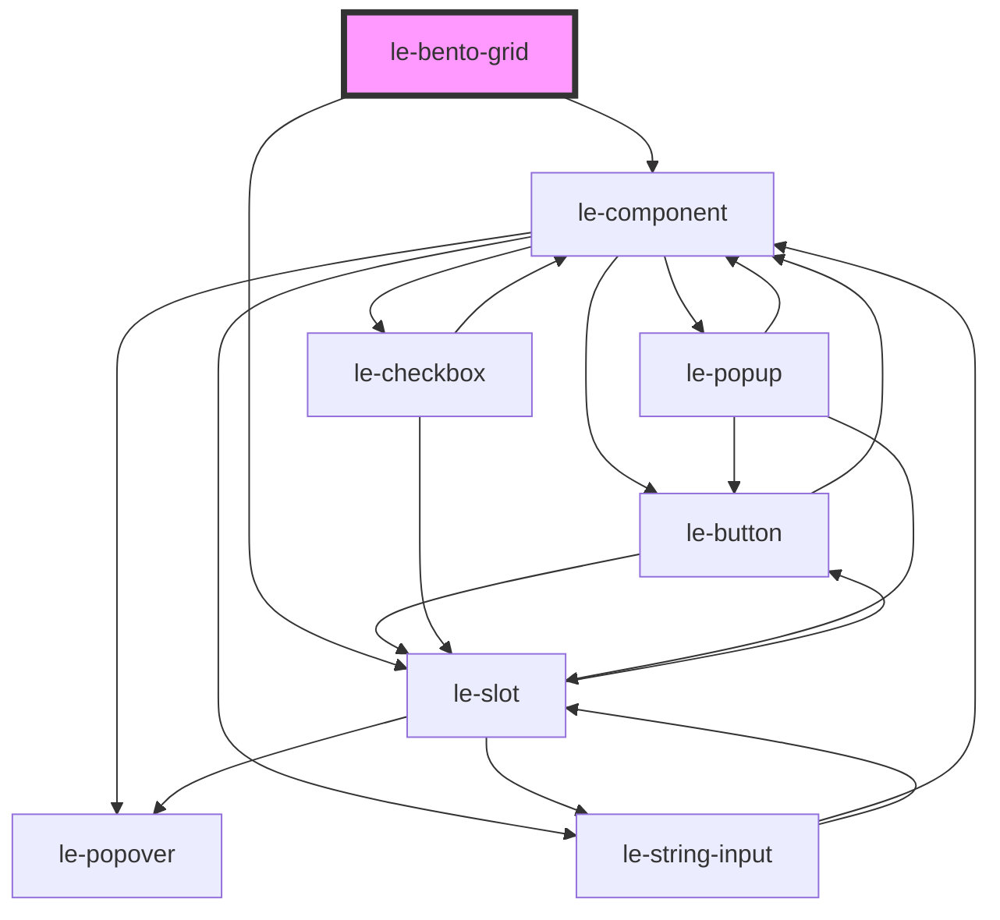

# le-bento-grid

<!-- Auto Generated Below -->

## Overview

A responsive bento-style CSS grid container.

`le-bento-grid` creates a dense auto-filling grid using `auto-fill` with
`minmax()` columns. Pair it with `le-bento-tile` children that declare
how many columns and rows they should span.

All sizing props can also be controlled purely via CSS custom properties —
useful when you want to configure from a stylesheet or a parent component.
If a prop is set, it writes the corresponding CSS custom property as an
inline style (which overrides any external stylesheet value).

## Properties

| Property         | Attribute          | Description                                                                                                                                                                                                                                                                                                                | Type     | Default     |
| ---------------- | ------------------ | -------------------------------------------------------------------------------------------------------------------------------------------------------------------------------------------------------------------------------------------------------------------------------------------------------------------------- | -------- | ----------- |
| `columnMaxWidth` | `column-max-width` | Maximum column width in pixels (maps to the `max` of CSS `minmax()`). The grid stops adding columns when dividing `max-width` by this value.                                                                                                                                                                               | `number` | `undefined` |
| `columnMinWidth` | `column-min-width` | Minimum column width in pixels (maps to the `min` of CSS `minmax()`). Controls how narrow a column can be before wrapping.                                                                                                                                                                                                 | `number` | `undefined` |
| `gap`            | `gap`              | Gap between tiles in pixels.                                                                                                                                                                                                                                                                                               | `number` | `undefined` |
| `maxColumns`     | `max-columns`      | Maximum number of columns before the grid wraps.  When set, this takes precedence over `maxWidth` and computes the grid's effective maximum width as: `maxColumns * columnMaxWidth + (maxColumns - 1) * gap`  This is useful when you want an explicit column cap without manually accounting for the gaps between tracks. | `number` | `undefined` |
| `maxWidth`       | `max-width`        | Maximum overall width of the grid in pixels.  Ignored when `maxColumns` is set.                                                                                                                                                                                                                                            | `number` | `undefined` |
| `minColumns`     | `min-columns`      | Minimum number of columns before overflow. Sets component `min-width` as: `columnMinWidth * minColumns + gap * (minColumns - 1)`.                                                                                                                                                                                          | `number` | `undefined` |
| `rowHeight`      | `row-height`       | Height of each row unit in pixels. A tile with `rows="2"` will be `2 × rowHeight + gap` tall.                                                                                                                                                                                                                              | `number` | `undefined` |

## Slots

| Slot | Description                                                   |
| ---- | ------------------------------------------------------------- |
|      | Accepts `le-bento-tile` elements (or any block-level content) |

## Shadow Parts

| Part     | Description |
| -------- | ----------- |
| `"grid"` |             |

## Dependencies

### Depends on

- [le-component](../le-component)
- [le-slot](../le-slot)

### Graph

----------------------------------------------

*Built with [StencilJS](https://stenciljs.com/)*
