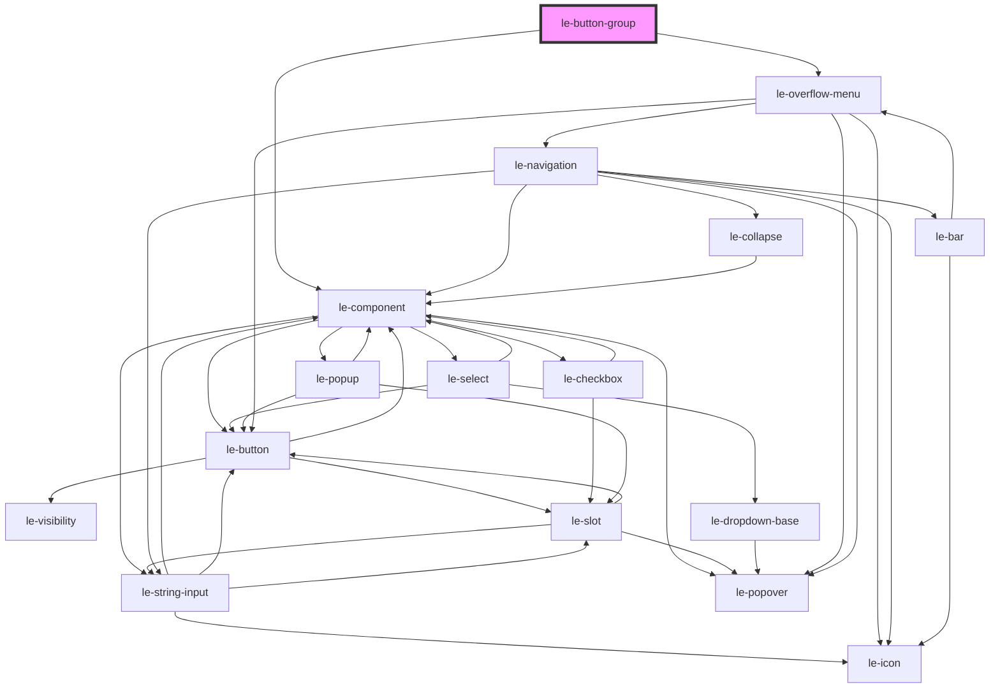

# le-button-group

<!-- Auto Generated Below -->

## Overview

Groups multiple `le-button` elements and optionally collapses low-priority actions
into an overflow "more" menu.

## Properties

| Property        | Attribute        | Description                                                                                                                                                                                                                            | Type                                       | Default     |
| --------------- | ---------------- | -------------------------------------------------------------------------------------------------------------------------------------------------------------------------------------------------------------------------------------- | ------------------------------------------ | ----------- |
| `collapse`      | `collapse`       | Collapse mode.  - `true`: show only the top-priority button - positive number: show top N buttons - `0`: show only the more button - negative number: hide abs(N) lowest-priority buttons  Non-integers are rounded with `Math.round`. | `boolean \| number \| string \| undefined` | `undefined` |
| `overflowIcons` | `overflow-icons` | When true, icons from collapsed buttons are shown in the overflow navigation list.                                                                                                                                                     | `boolean`                                  | `false`     |

## Events

| Event              | Description | Type                           |
| ------------------ | ----------- | ------------------------------ |
| `leOverflowSelect` |             | `CustomEvent<{ id: string; }>` |

## Slots

| Slot     | Description                                         |
| -------- | --------------------------------------------------- |
|          | Group button elements (`le-button` children)        |
| `"more"` | Custom icon/content for the overflow trigger button |

## Shadow Parts

| Part      | Description |
| --------- | ----------- |
| `"group"` |             |

## Dependencies

### Depends on

- [le-component](../le-component)
- [le-overflow-menu](../le-overflow-menu)

### Graph

----------------------------------------------

*Built with [StencilJS](https://stenciljs.com/)*
