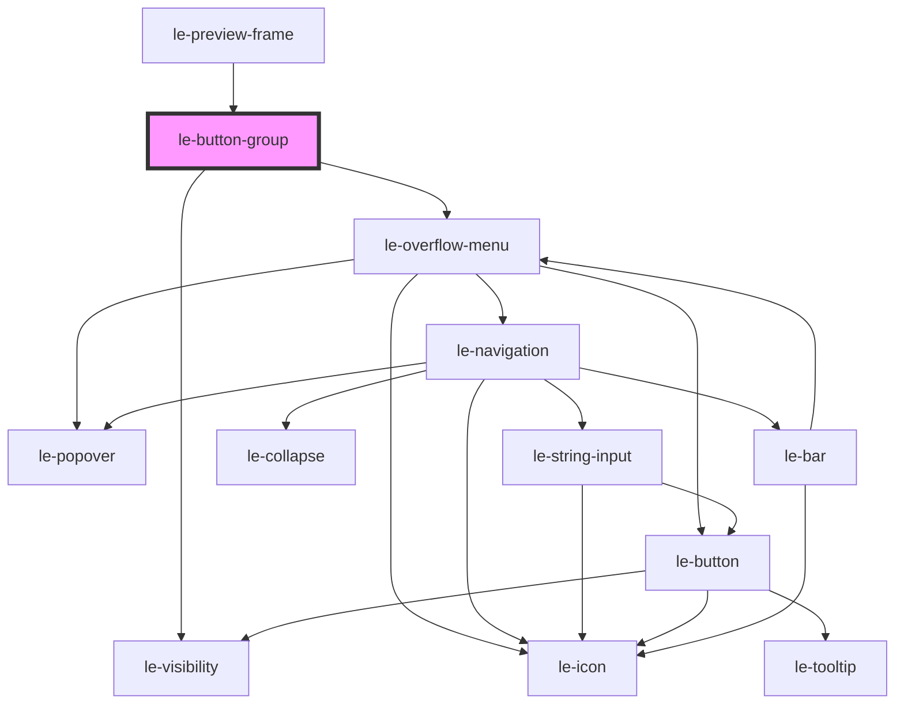

# le-button-group

<!-- Auto Generated Below -->

## Overview

Groups multiple `le-button` elements and optionally collapses low-priority actions
into an overflow "more" menu.

## Properties

| Property        | Attribute        | Description                                                                                                                                                                                                                            | Type                                                      | Default     |
| --------------- | ---------------- | -------------------------------------------------------------------------------------------------------------------------------------------------------------------------------------------------------------------------------------- | --------------------------------------------------------- | ----------- |
| `collapse`      | `collapse`       | Collapse mode.  - `true`: show only the top-priority button - positive number: show top N buttons - `0`: show only the more button - negative number: hide abs(N) lowest-priority buttons  Non-integers are rounded with `Math.round`. | `boolean \| number \| string \| undefined`                | `undefined` |
| `disabled`      | `disabled`       | Disabled attribute, when the button group is disabled, all buttons inside will be disabled and the overflow menu will not be accessible.                                                                                               | `boolean`                                                 | `false`     |
| `label`         | `label`          | Optional label used when the whole group is represented as a parent item inside another component's overflow menu.                                                                                                                     | `string \| undefined`                                     | `undefined` |
| `overflowIcons` | `overflow-icons` | When true, icons from collapsed buttons are shown in the overflow navigation list.                                                                                                                                                     | `boolean`                                                 | `false`     |
| `type`          | `type`           | Selection type: radio (single select) or checkbox (multi select)                                                                                                                                                                       | `"checkbox" \| "radio" \| undefined`                      | `undefined` |
| `value`         | `value`          | Selected value(s). If type is 'radio', value is a string. If type is 'checkbox', value is a string or string[].                                                                                                                        | `string \| string[] \| undefined`                         | `undefined` |
| `visibility`    | `visibility`     | Visibility state used by responsive containers such as le-toolbar.                                                                                                                                                                     | `"collapsed" \| "collapsing" \| "expanding" \| "visible"` | `'visible'` |

## Events

| Event              | Description | Type                                                             |
| ------------------ | ----------- | ---------------------------------------------------------------- |
| `leChange`         |             | `CustomEvent<LeMultiOptionSelectDetail \| LeOptionSelectDetail>` |
| `leOverflowSelect` |             | `CustomEvent<{ id: string; }>`                                   |

## Methods

### `getCollapseMeta() => Promise<LeCollapseMeta>`

Returns collapse meta for toolbar integration.

#### Returns

Type: `Promise<LeCollapseMeta>`

### `getItemsMeta() => Promise<LeButtonGroupItemsMeta>`

#### Returns

Type: `Promise<LeButtonGroupItemsMeta>`

### `getToolbarOverflowGroupOption() => Promise<LeOption>`

#### Returns

Type: `Promise<LeOption>`

### `getToolbarOverflowItems() => Promise<LeOption[]>`

#### Returns

Type: `Promise<LeOption[]>`

### `whenLayoutSettled() => Promise<void>`

#### Returns

Type: `Promise<void>`

## Slots

| Slot     | Description                                         |
| -------- | --------------------------------------------------- |
|          | Group button elements (`le-button` children)        |
| `"more"` | Custom icon/content for the overflow trigger button |

## Shadow Parts

| Part      | Description |
| --------- | ----------- |
| `"group"` |             |

## Dependencies

### Used by

 - [le-preview-frame](../le-preview-frame)

### Depends on

- [le-visibility](../le-visibility)
- [le-overflow-menu](../le-overflow-menu)

### Graph

```mermaid
graph TD;
  le-button-group --> le-visibility
  le-button-group --> le-overflow-menu
  le-overflow-menu --> le-navigation
  le-overflow-menu --> le-popover
  le-overflow-menu --> le-button
  le-overflow-menu --> le-icon
  le-navigation --> le-icon
  le-navigation --> le-string-input
  le-navigation --> le-collapse
  le-navigation --> le-popover
  le-navigation --> le-bar
  le-string-input --> le-button
  le-string-input --> le-icon
  le-button --> le-icon
  le-button --> le-visibility
  le-button --> le-tooltip
  le-bar --> le-icon
  le-bar --> le-overflow-menu
  le-preview-frame --> le-button-group
  style le-button-group fill:#f9f,stroke:#333,stroke-width:4px
```

----------------------------------------------

*Built with [StencilJS](https://stenciljs.com/)*
