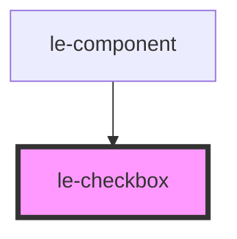

# le-checkbox

<!-- Auto Generated Below -->

## Overview

A checkbox component with support for labels, descriptions, and external IDs.

## Properties

| Property     | Attribute     | Description                                                                                                                                                                  | Type                  | Default                                                           |
| ------------ | ------------- | ---------------------------------------------------------------------------------------------------------------------------------------------------------------------------- | --------------------- | ----------------------------------------------------------------- |
| `checked`    | `checked`     | Whether the checkbox is checked                                                                                                                                              | `boolean`             | `false`                                                           |
| `disabled`   | `disabled`    | Whether the checkbox is disabled                                                                                                                                             | `boolean`             | `false`                                                           |
| `externalId` | `external-id` | External ID for linking with external systems (e.g. database ID, PDF form field ID)                                                                                          | `string \| undefined` | `undefined`                                                       |
| `id`         | `id`          | The ID of the checkbox input. This is used for linking the label to the input for accessibility. In case there is no ID provided, a random one will be generated internally. | `string`              | `` `le-checkbox-${Math.random().toString(36).substring(2, 9)}` `` |
| `name`       | `name`        | The name of the checkbox input                                                                                                                                               | `string \| undefined` | `undefined`                                                       |
| `value`      | `value`       | The value of the checkbox input                                                                                                                                              | `string \| undefined` | `undefined`                                                       |

## Events

| Event    | Description                            | Type                                                                                                                            |
| -------- | -------------------------------------- | ------------------------------------------------------------------------------------------------------------------------------- |
| `change` | Emitted when the checked state changes | `CustomEvent<{ checked: boolean; value?: string \| undefined; name?: string \| undefined; externalId?: string \| undefined; }>` |

## Slots

| Slot            | Description                                           |
| --------------- | ----------------------------------------------------- |
|                 | The label text for the checkbox                       |
| `"description"` | Additional description text displayed below the label |

## Dependencies

### Used by

 - [le-component](../le-component)

### Graph

----------------------------------------------

*Built with [StencilJS](https://stenciljs.com/)*
