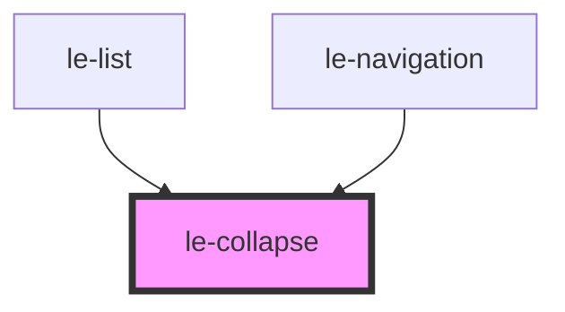

# le-collapse

<!-- Auto Generated Below -->

## Overview

Animated show/hide wrapper.

Supports height collapse (auto->0) and/or fading.
Can optionally listen to the nearest `le-header` shrink events.

## Properties

| Property                 | Attribute                   | Description                                                                                                                                  | Type      | Default |
| ------------------------ | --------------------------- | -------------------------------------------------------------------------------------------------------------------------------------------- | --------- | ------- |
| `closed`                 | `closed`                    | Since Stencil boolean props default to `false` when the attribute is missing. instead of `open` defaulting to `true`, using a `closed` prop. | `boolean` | `false` |
| `collapseOnHeaderShrink` | `collapse-on-header-shrink` | If true, collapse/expand based on the nearest header shrink event.                                                                           | `boolean` | `false` |
| `noFading`               | `no-fading`                 | Stop fading the content when collapsing/expanding.                                                                                           | `boolean` | `false` |
| `scrollDown`             | `scroll-down`               | Whether the content should scroll down from the top when open.                                                                               | `boolean` | `false` |

## Slots

| Slot | Description        |
| ---- | ------------------ |
|      | Content to animate |

## Shadow Parts

| Part       | Description |
| ---------- | ----------- |
| `"region"` |             |

## Dependencies

### Used by

 - [le-list](../le-list)
 - [le-navigation](../le-navigation)

### Graph

----------------------------------------------

*Built with [StencilJS](https://stenciljs.com/)*
