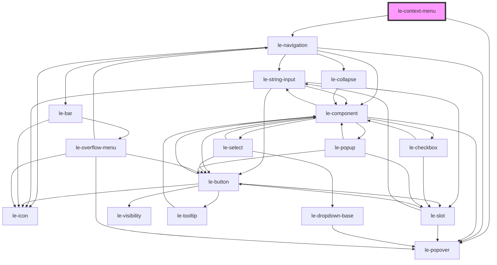

# le-context-menu

<!-- Auto Generated Below -->

## Overview

Context menu component that displays a vertical navigation menu
when the user right-clicks or long-presses on its children.

## Properties

| Property             | Attribute              | Description                                                                                                                                                                       | Type                                                | Default        |
| -------------------- | ---------------------- | --------------------------------------------------------------------------------------------------------------------------------------------------------------------------------- | --------------------------------------------------- | -------------- |
| `align`              | `align`                | Alignment of the menu relative to the trigger.                                                                                                                                    | `"center" \| "end" \| "start"`                      | `'start'`      |
| `backdrop`           | `backdrop`             | Whether to show a backdrop behind the menu, lifting the active item.                                                                                                              | `boolean`                                           | `false`        |
| `disabled`           | `disabled`             | Disables right-click and touch interactions.                                                                                                                                      | `boolean`                                           | `false`        |
| `items`              | `items`                | List of menu items represented as options.                                                                                                                                        | `LeOption[] \| string`                              | `[]`           |
| `open`               | `open`                 | Whether the context menu is open.                                                                                                                                                 | `boolean`                                           | `false`        |
| `pageScrollBehavior` | `page-scroll-behavior` | Behavior of the menu on page scroll: - 'blocked': blocks page scroll - 'menu-close': closes the menu automatically on scroll - 'fixed-menu': menu scrolls with the page (default) | `"blocked" \| "fixed-menu" \| "menu-close"`         | `'fixed-menu'` |
| `position`           | `position`             | Position of the menu relative to the trigger. If 'mouse', positions next to mouse/touch coords.                                                                                   | `"bottom" \| "left" \| "mouse" \| "right" \| "top"` | `'mouse'`      |

## Events

| Event                 | Description                              | Type                                     |
| --------------------- | ---------------------------------------- | ---------------------------------------- |
| `leContextMenuClose`  | Emitted when the context menu is closed. | `CustomEvent<void>`                      |
| `leContextMenuSelect` | Emitted when a menu item is selected.    | `CustomEvent<LeContextMenuSelectDetail>` |

## Methods

### `hide() => Promise<void>`

#### Returns

Type: `Promise<void>`

### `show(x?: number, y?: number) => Promise<void>`

#### Parameters

| Name | Type                  | Description |
| ---- | --------------------- | ----------- |
| `x`  | `number \| undefined` |             |
| `y`  | `number \| undefined` |             |

#### Returns

Type: `Promise<void>`

### `toggle(x?: number, y?: number) => Promise<void>`

#### Parameters

| Name | Type                  | Description |
| ---- | --------------------- | ----------- |
| `x`  | `number \| undefined` |             |
| `y`  | `number \| undefined` |             |

#### Returns

Type: `Promise<void>`

## Slots

| Slot | Description     |
| ---- | --------------- |
|      | Trigger content |

## Dependencies

### Depends on

- [le-popover](../le-popover)
- [le-navigation](../le-navigation)

### Graph

----------------------------------------------

*Built with [StencilJS](https://stenciljs.com/)*
