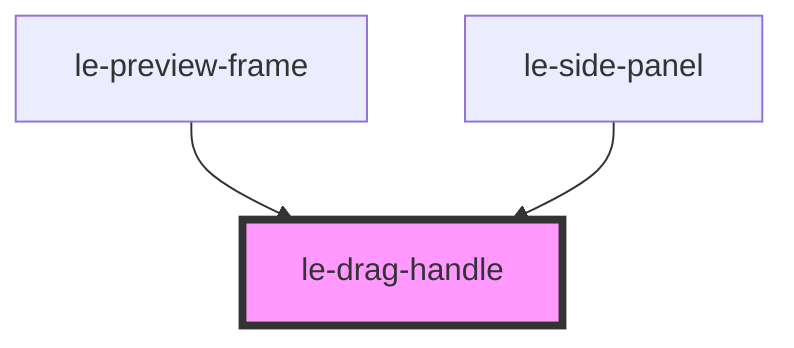

# le-drag-handle

<!-- Auto Generated Below -->

## Overview

Reusable drag handle used by resizable components.

## Properties

| Property      | Attribute     | Description                                                           | Type                         | Default      |
| ------------- | ------------- | --------------------------------------------------------------------- | ---------------------------- | ------------ |
| `orientation` | `orientation` | Handle orientation (vertical = width drag, horizontal = height drag). | `"horizontal" \| "vertical"` | `'vertical'` |
| `placement`   | `placement`   | Handle position on the owning edge.                                   | `"end" \| "start"`           | `'end'`      |

## Slots

| Slot | Description                                 |
| ---- | ------------------------------------------- |
|      | Optional assistive text for screen readers. |

## Shadow Parts

| Part     | Description |
| -------- | ----------- |
| `"grip"` |             |

## Dependencies

### Used by

 - [le-preview-frame](../le-preview-frame)
 - [le-side-panel](../le-side-panel)

### Graph

----------------------------------------------

*Built with [StencilJS](https://stenciljs.com/)*
