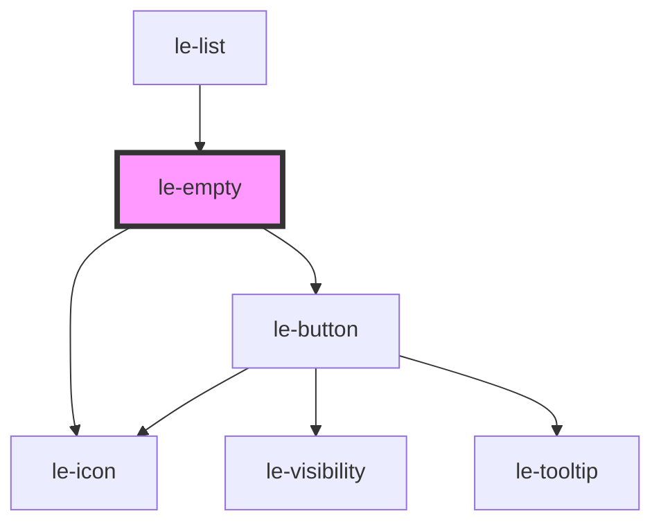

# le-empty

<!-- Auto Generated Below -->

## Overview

An empty state component inspired by SwiftUI ContentUnavailableView.
Used for displaying empty lists, search results, or unavailable states.

## Properties

| Property      | Attribute      | Description                                  | Type                  | Default     |
| ------------- | -------------- | -------------------------------------------- | --------------------- | ----------- |
| `actionLabel` | `action-label` | Label for optional action button.            | `string \| undefined` | `undefined` |
| `icon`        | `icon`         | Optional icon name, URL, or emoji character. | `string \| undefined` | `undefined` |
| `label`       | `label`        | Main label text for the empty state.         | `string \| undefined` | `undefined` |
| `message`     | `message`      | Secondary descriptive message.               | `string \| undefined` | `undefined` |

## Events

| Event      | Description                                | Type                      |
| ---------- | ------------------------------------------ | ------------------------- |
| `leAction` | Emitted when the action button is clicked. | `CustomEvent<MouseEvent>` |

## Slots

| Slot        | Description                          |
| ----------- | ------------------------------------ |
|             | Default slot for custom body content |
| `"action"`  | Custom action buttons slot           |
| `"icon"`    | Custom icon slot                     |
| `"label"`   | Custom label/title slot              |
| `"message"` | Custom message/description slot      |

## Shadow Parts

| Part               | Description |
| ------------------ | ----------- |
| `"action-button"`  |             |
| `"icon-container"` |             |
| `"label"`          |             |

## Dependencies

### Used by

 - [le-list](../le-list)

### Depends on

- [le-icon](../le-icon)
- [le-button](../le-button)

### Graph

----------------------------------------------

*Built with [StencilJS](https://stenciljs.com/)*
