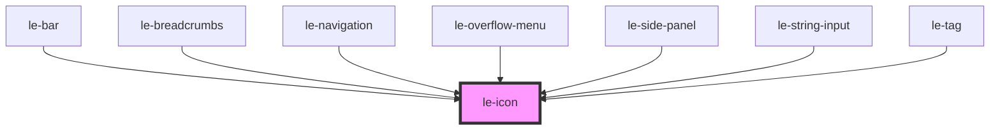

# le-icon

<!-- Auto Generated Below -->

## Properties

| Property | Attribute | Description                                                                                                                           | Type                  | Default     |
| -------- | --------- | ------------------------------------------------------------------------------------------------------------------------------------- | --------------------- | ----------- |
| `name`   | `name`    | Name of the icon to display. Corresponds to a JSON file in the assets folder. For example, "search" will load the "search.json" file. | `string \| undefined` | `undefined` |
| `size`   | `size`    | Size of the icon in pixels. Default is 16.                                                                                            | `number`              | `16`        |

## Dependencies

### Used by

 - [le-bar](../le-bar)
 - [le-breadcrumbs](../le-breadcrumbs)
 - [le-navigation](../le-navigation)
 - [le-overflow-menu](../le-overflow-menu)
 - [le-side-panel](../le-side-panel)
 - [le-string-input](../le-string-input)
 - [le-tag](../le-tag)

### Graph

----------------------------------------------

*Built with [StencilJS](https://stenciljs.com/)*
