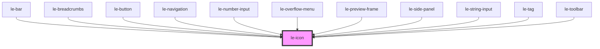

# le-icon

<!-- Auto Generated Below -->

## Properties

| Property        | Attribute        | Description                                                                                                                                                                                                                                                                        | Type                  | Default     |
| --------------- | ---------------- | ---------------------------------------------------------------------------------------------------------------------------------------------------------------------------------------------------------------------------------------------------------------------------------- | --------------------- | ----------- |
| `badge`         | `badge`          | Name of a badge icon to overlay on top of the base icon. The badge icon is loaded and composed with mask-based knockout.                                                                                                                                                           | `string \| undefined` | `undefined` |
| `badgePosition` | `badge-position` | Position of the badge icon within the base icon's viewBox. Comma-separated x,y values in viewBox units or percentages. Positive values = from start/top, Negative values = from end/bottom. Percentages work like CSS background-position. Default: "-5, -5" (bottom-right area).  | `string \| undefined` | `undefined` |
| `badgeScale`    | `badge-scale`    | Scale factor for the badge icon. Default: 1.0. Badge icons are designed at their natural display size, so 1.0 means no scaling. Use >1 to enlarge, <1 to shrink.                                                                                                                   | `number \| undefined` | `undefined` |
| `layers`        | `layers`         | JSON string defining additional icon layers to compose on top of the base icon. Each layer has a name, optional position, and optional scale. Layers are rendered in order (first = bottom, last = top), and each layer's maskShape (if present) cuts through all layers below it. | `string \| undefined` | `undefined` |
| `name`          | `name`           | Name of the icon to display. Corresponds to a JSON file in the assets folder. For example, "search" will load the "search.json" file.                                                                                                                                              | `string \| undefined` | `undefined` |
| `size`          | `size`           | Size of the icon in pixels. Default is 16.                                                                                                                                                                                                                                         | `number`              | `16`        |

## Dependencies

### Used by

 - [le-bar](../le-bar)
 - [le-breadcrumbs](../le-breadcrumbs)
 - [le-button](../le-button)
 - [le-navigation](../le-navigation)
 - [le-number-input](../le-number-input)
 - [le-overflow-menu](../le-overflow-menu)
 - [le-preview-frame](../le-preview-frame)
 - [le-side-panel](../le-side-panel)
 - [le-string-input](../le-string-input)
 - [le-tag](../le-tag)
 - [le-toolbar](../le-toolbar)

### Graph

```mermaid
graph TD;
  le-bar --> le-icon
  le-breadcrumbs --> le-icon
  le-button --> le-icon
  le-navigation --> le-icon
  le-number-input --> le-icon
  le-overflow-menu --> le-icon
  le-preview-frame --> le-icon
  le-side-panel --> le-icon
  le-string-input --> le-icon
  le-tag --> le-icon
  le-toolbar --> le-icon
  style le-icon fill:#f9f,stroke:#333,stroke-width:4px
```

----------------------------------------------

*Built with [StencilJS](https://stenciljs.com/)*
