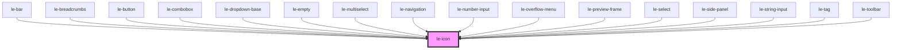

# le-icon

<!-- Auto Generated Below -->

## Properties

| Property         | Attribute          | Description                                                                                                                                                                                                                                                                        | Type                             | Default     |
| ---------------- | ------------------ | ---------------------------------------------------------------------------------------------------------------------------------------------------------------------------------------------------------------------------------------------------------------------------------- | -------------------------------- | ----------- |
| `badge`          | `badge`            | Name of a badge icon to overlay on top of the base icon. The badge icon is loaded and composed with mask-based knockout.                                                                                                                                                           | `string \| undefined`            | `undefined` |
| `badgeColor`     | `badge-color`      | Optional color for the badge icon or background (CSS color or variable). Defaults to 'transparent'.                                                                                                                                                                                | `string \| undefined`            | `undefined` |
| `badgeOpacity`   | `badge-opacity`    | Optional opacity for the badge icon (0 to 1).                                                                                                                                                                                                                                      | `number \| undefined`            | `undefined` |
| `badgePosition`  | `badge-position`   | Position of the badge icon within the base icon's viewBox. Comma-separated x,y values in viewBox units or percentages. Positive values = from start/top, Negative values = from end/bottom. Percentages work like CSS background-position. Default: "-5, -5" (bottom-right area).  | `string \| undefined`            | `undefined` |
| `badgeScale`     | `badge-scale`      | Scale factor for the badge icon. Default: 1.0. Badge icons are designed at their natural display size, so 1.0 means no scaling. Use >1 to enlarge, <1 to shrink.                                                                                                                   | `number \| undefined`            | `undefined` |
| `badgeText`      | `badge-text`       | Optional text string for notification badge (e.g. "NEW"). Can also be set as boolean attribute `<le-icon badge-text></le-icon>` for an empty dot.                                                                                                                                  | `boolean \| string \| undefined` | `undefined` |
| `badgeTextColor` | `badge-text-color` | Optional text/font color for the badge text.                                                                                                                                                                                                                                       | `string \| undefined`            | `undefined` |
| `baseColor`      | `base-color`       | Optional color for the base icon (CSS color or variable).                                                                                                                                                                                                                          | `string \| undefined`            | `undefined` |
| `count`          | `count`            | Optional numeric count for notification badge (e.g. 5 or 120).                                                                                                                                                                                                                     | `number \| undefined`            | `undefined` |
| `dot`            | `dot`              | Whether to display an empty circle dot badge.                                                                                                                                                                                                                                      | `boolean \| undefined`           | `undefined` |
| `filled`         | `filled`           | Whether to use filled variants of icon elements if defined in icon JSON. If not explicitly set, defaults to the global le-kit config (`icons.defaultFilled`).                                                                                                                      | `boolean \| undefined`           | `undefined` |
| `layers`         | `layers`           | JSON string defining additional icon layers to compose on top of the base icon. Each layer has a name, optional position, and optional scale. Layers are rendered in order (first = bottom, last = top), and each layer's maskShape (if present) cuts through all layers below it. | `string \| undefined`            | `undefined` |
| `maxCount`       | `max-count`        | Optional max count threshold (e.g. 99 -> "99+").                                                                                                                                                                                                                                   | `number \| undefined`            | `undefined` |
| `name`           | `name`             | Name of the icon to display. Corresponds to a JSON file in the assets folder. For example, "search" will load the "search.json" file.                                                                                                                                              | `string \| undefined`            | `undefined` |
| `outlined`       | `outlined`         | Whether to force outlined (non-filled) variants of icon elements. Overrides `filled` prop, registry settings, and global defaults.                                                                                                                                                 | `boolean \| undefined`           | `undefined` |
| `rounded`        | `rounded`          | Whether to use rounded variants of icon elements if defined in icon JSON. If not explicitly set, defaults to the global le-kit config (`icons.defaultRounded`).                                                                                                                    | `boolean \| undefined`           | `undefined` |
| `sharp`          | `sharp`            | Whether to force sharp (non-rounded) variants of icon elements. Overrides `rounded` prop, registry settings, and global defaults.                                                                                                                                                  | `boolean \| undefined`           | `undefined` |
| `size`           | `size`             | Size of the icon in pixels or CSS value. If omitted, controlled by CSS `--le-icon-size` (default: 16px).                                                                                                                                                                           | `number \| string \| undefined`  | `undefined` |
| `thin`           | `thin`             | Whether to use thin variants of icon elements if defined in icon JSON. If not explicitly set, defaults to the global le-kit config (`icons.defaultThin`).                                                                                                                          | `boolean \| undefined`           | `undefined` |
| `viewBox`        | `view-box`         | Custom viewBox for the SVG. When set, overrides the viewBox from the loaded icon data. Useful for layer-only compositions without a base icon.                                                                                                                                     | `string \| undefined`            | `undefined` |

## Dependencies

### Used by

 - [le-bar](../le-bar)
 - [le-breadcrumbs](../le-breadcrumbs)
 - [le-button](../le-button)
 - [le-combobox](../le-combobox)
 - [le-dropdown-base](../le-dropdown-base)
 - [le-empty](../le-empty)
 - [le-multiselect](../le-multiselect)
 - [le-navigation](../le-navigation)
 - [le-number-input](../le-number-input)
 - [le-overflow-menu](../le-overflow-menu)
 - [le-preview-frame](../le-preview-frame)
 - [le-select](../le-select)
 - [le-side-panel](../le-side-panel)
 - [le-string-input](../le-string-input)
 - [le-tag](../le-tag)
 - [le-toolbar](../le-toolbar)

### Graph

```mermaid
graph TD;
  le-bar --> le-icon
  le-breadcrumbs --> le-icon
  le-button --> le-icon
  le-combobox --> le-icon
  le-dropdown-base --> le-icon
  le-empty --> le-icon
  le-multiselect --> le-icon
  le-navigation --> le-icon
  le-number-input --> le-icon
  le-overflow-menu --> le-icon
  le-preview-frame --> le-icon
  le-select --> le-icon
  le-side-panel --> le-icon
  le-string-input --> le-icon
  le-tag --> le-icon
  le-toolbar --> le-icon
  style le-icon fill:#f9f,stroke:#333,stroke-width:4px
```

----------------------------------------------

*Built with [StencilJS](https://stenciljs.com/)*
