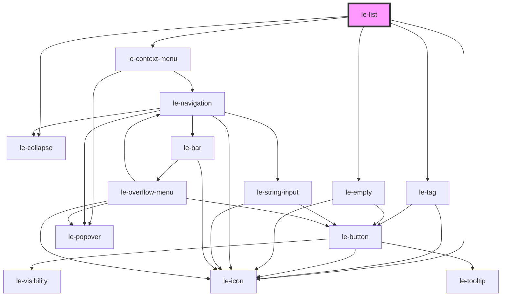

# le-list

<!-- Auto Generated Below -->

## Properties

| Property                    | Attribute                     | Description                                                                                                                                                                                                                                                                                                     | Type                                               | Default                                                   |
| --------------------------- | ----------------------------- | --------------------------------------------------------------------------------------------------------------------------------------------------------------------------------------------------------------------------------------------------------------------------------------------------------------- | -------------------------------------------------- | --------------------------------------------------------- |
| `actionChevron`             | `action-chevron`              | Alias for showActionChevron.                                                                                                                                                                                                                                                                                    | `boolean`                                          | `false`                                                   |
| `allowClearSort`            | `allow-clear-sort`            | Whether clicking a sorted column header a 3rd time clears sorting back to unsorted. Defaults to true.                                                                                                                                                                                                           | `boolean`                                          | `true`                                                    |
| `allowColumnReorder`        | `allow-column-reorder`        | Alias for columnReorder.                                                                                                                                                                                                                                                                                        | `boolean`                                          | `false`                                                   |
| `allowColumnToggle`         | `allow-column-toggle`         | Alias for columnVisibilityToggle.                                                                                                                                                                                                                                                                               | `boolean`                                          | `false`                                                   |
| `columnReorder`             | `column-reorder`              | Whether to allow column reordering via right-click header context menu. Defaults to false.                                                                                                                                                                                                                      | `boolean`                                          | `false`                                                   |
| `columnSeparators`          | `column-separators`           | Column separation style: 'none' \| 'borders' \| 'zebra'. Defaults to 'none'.                                                                                                                                                                                                                                    | `"borders" \| "none" \| "zebra"`                   | `'none'`                                                  |
| `columnVisibilityToggle`    | `column-visibility-toggle`    | Whether to enable right-click context menu on table header row to toggle column visibility. Defaults to false.                                                                                                                                                                                                  | `boolean`                                          | `false`                                                   |
| `columns`                   | `columns`                     | Column configuration for the list table view. Can be an array of `LeColumn` objects or a JSON string. If omitted, columns will be automatically generated from data item properties.                                                                                                                            | `LeColumn[] \| string`                             | `[]`                                                      |
| `data`                      | `data`                        | Data items to display in the list. Can be an array of `LeOption` objects or a JSON string. If omitted or empty, top-level `<le-item>` child elements will be parsed.                                                                                                                                            | `LeOption[] \| string`                             | `[]`                                                      |
| `defaultSortDirection`      | `default-sort-direction`      | Default initial sort direction for sortable columns on first click ('asc' \| 'desc'). Individual columns can override this via their `sortStart` property. Defaults to 'asc'.                                                                                                                                   | `"asc" \| "desc"`                                  | `'asc'`                                                   |
| `defaultSortIconPosition`   | `default-sort-icon-position`  | Default sort icon placement across columns ('start' \| 'end' \| 'none'). If omitted, right-aligned columns default to 'start' and left/center columns default to 'end'.                                                                                                                                         | `"end" \| "none" \| "start" \| undefined`          | `undefined`                                               |
| `disableKeyboardNavigation` | `disable-keyboard-navigation` | Whether to disable keyboard navigation. Defaults to false.                                                                                                                                                                                                                                                      | `boolean`                                          | `false`                                                   |
| `disableRowHover`           | `disable-row-hover`           | Whether to disable row highlighting on hover. Defaults to false (row hover highlighting is enabled by default).                                                                                                                                                                                                 | `boolean`                                          | `false`                                                   |
| `emptyIcon`                 | `empty-icon`                  | Icon for default empty state (<le-empty>).                                                                                                                                                                                                                                                                      | `string \| undefined`                              | `undefined`                                               |
| `emptyLabel`                | `empty-label`                 | Main label text for default empty state (<le-empty>).                                                                                                                                                                                                                                                           | `string \| undefined`                              | `undefined`                                               |
| `emptyMessage`              | `empty-message`               | Secondary description text for default empty state (<le-empty>).                                                                                                                                                                                                                                                | `string \| undefined`                              | `undefined`                                               |
| `emptyTitle`                | `empty-title`                 | Title text for default empty state (<le-empty>).                                                                                                                                                                                                                                                                | `string \| undefined`                              | `undefined`                                               |
| `maxReorderDepth`           | `max-reorder-depth`           | Maximum allowed nesting depth for drag-and-drop reordering. When hovering over items at or deeper than this depth, children cannot be added (items split 50/50).                                                                                                                                                | `number \| undefined`                              | `undefined`                                               |
| `reorder`                   | `reorder`                     | Enables manual drag-and-drop reordering of list row items. - 'none': Disabled (default) - 'siblings': Can only reorder within current parent/root siblings - 'nested': Can reorder across hierarchical levels (inside/outside parents) Note: Can also be passed as boolean (true -> 'nested', false -> 'none'). | `"nested" \| "none" \| "siblings" \| boolean`      | `'none'`                                                  |
| `reorderExpandDelay`        | `reorder-expand-delay`        | Delay in ms before automatically expanding a hovered collapsed item during drag-and-drop.                                                                                                                                                                                                                       | `number`                                           | `500`                                                     |
| `reorderRatios`             | --                            | Configurable position target ratios for top (before), middle (inside), and bottom (after) drop zones. Default: { top: 0.35, middle: 0.3, bottom: 0.35 }.                                                                                                                                                        | `{ top: number; middle: number; bottom: number; }` | `{     top: 0.35,     middle: 0.3,     bottom: 0.35,   }` |
| `rowSeparators`             | `row-separators`              | Row separation style: 'none' \| 'borders' \| 'zebra'. Defaults to 'zebra'.                                                                                                                                                                                                                                      | `"borders" \| "none" \| "zebra"`                   | `'zebra'`                                                 |
| `selection`                 | `selection`                   | Selection mode for rows: false / 'none' (disabled), true / 'single', or 'multiple'. Defaults to false.                                                                                                                                                                                                          | `"multiple" \| "none" \| "single" \| boolean`      | `false`                                                   |
| `showActionChevron`         | `show-action-chevron`         | Whether to display chevron-right icon at the end of rows that have actions or links. Defaults to false.                                                                                                                                                                                                         | `boolean`                                          | `false`                                                   |
| `showReorderHandle`         | `show-reorder-handle`         | Whether to show the drag handle icon (`reorder-horizontal`) at the end of reorderable rows. Default: false.                                                                                                                                                                                                     | `boolean`                                          | `false`                                                   |

## Events

| Event                      | Description                                                    | Type                                                                                                                    |
| -------------------------- | -------------------------------------------------------------- | ----------------------------------------------------------------------------------------------------------------------- |
| `leAction`                 | Emitted when a row action or link is executed.                 | `CustomEvent<{ action?: string \| undefined; item: LeOption; id: string; originalEvent?: Event \| undefined; }>`        |
| `leColumnOrderChange`      | Emitted when column order changes via the context menu.        | `CustomEvent<{ columns: LeColumn[]; draggedColumn: LeColumn; targetColumn?: LeColumn \| undefined; }>`                  |
| `leColumnVisibilityChange` | Emitted when column visibility changes via the context menu.   | `CustomEvent<{ columns: LeColumn[]; toggledColumn: LeColumn; hidden: boolean; }>`                                       |
| `leItemReorder`            | Fired when list row items are reordered via drag and drop.     | `CustomEvent<LeListItemReorderDetail>`                                                                                  |
| `leItemToggle`             | Emitted when a hierarchical row item is expanded or collapsed. | `CustomEvent<{ item: LeOption; open: boolean; originalEvent?: MouseEvent \| undefined; }>`                              |
| `leReorder`                | Alias for `leItemReorder`.                                     | `CustomEvent<LeListItemReorderDetail>`                                                                                  |
| `leSelectionChange`        | Emitted when row selection changes.                            | `CustomEvent<{ selectedIds: string[]; selectedItems: LeOption[]; isMultiple: boolean; }>`                               |
| `leSortChange`             | Emitted when column sorting changes.                           | `CustomEvent<{ key?: string \| undefined; column?: LeColumn \| undefined; direction?: "desc" \| "asc" \| undefined; }>` |

## Methods

### `disableReorder() => Promise<void>`

Programmatically disable reordering.

#### Returns

Type: `Promise<void>`

### `enableReorder(mode?: LeListReorderMode) => Promise<void>`

Programmatically enable reordering.

#### Parameters

| Name   | Type                               | Description |
| ------ | ---------------------------------- | ----------- |
| `mode` | `"none" \| "siblings" \| "nested"` |             |

#### Returns

Type: `Promise<void>`

### `moveItem(draggedQuery: string, targetQuery: string, position?: "before" | "inside" | "after") => Promise<{ success: boolean; detail?: LeListItemReorderDetail; }>`

Programmatically move an item relative to another item in the list tree.
Accepts item ID, value, or label for both dragged and target items.

#### Parameters

| Name           | Type                              | Description |
| -------------- | --------------------------------- | ----------- |
| `draggedQuery` | `string`                          |             |
| `targetQuery`  | `string`                          |             |
| `position`     | `"after" \| "before" \| "inside"` |             |

#### Returns

Type: `Promise<{ success: boolean; detail?: LeListItemReorderDetail | undefined; }>`

### `setReorder(mode: LeListReorderMode | boolean) => Promise<void>`

Programmatically set the reorder mode ('none', 'siblings', 'nested', or boolean).

#### Parameters

| Name   | Type                           | Description |
| ------ | ------------------------------ | ----------- |
| `mode` | `boolean \| LeListReorderMode` |             |

#### Returns

Type: `Promise<void>`

## Shadow Parts

| Part            | Description |
| --------------- | ----------- |
| `"header"`      |             |
| `"header-cell"` |             |

## Dependencies

### Depends on

- [le-icon](../le-icon)
- [le-tag](../le-tag)
- [le-collapse](../le-collapse)
- [le-empty](../le-empty)
- [le-context-menu](../le-context-menu)

### Graph

----------------------------------------------

*Built with [StencilJS](https://stenciljs.com/)*
