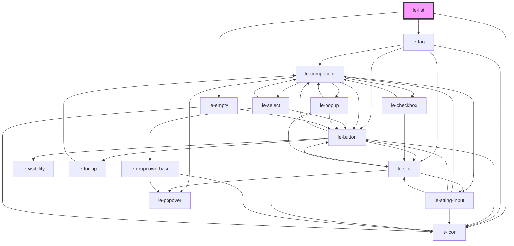

# le-list

<!-- Auto Generated Below -->

## Properties

| Property                  | Attribute                    | Description                                                                                                                                                                          | Type                                      | Default     |
| ------------------------- | ---------------------------- | ------------------------------------------------------------------------------------------------------------------------------------------------------------------------------------ | ----------------------------------------- | ----------- |
| `allowClearSort`          | `allow-clear-sort`           | Whether clicking a sorted column header a 3rd time clears sorting back to unsorted. Defaults to true.                                                                                | `boolean`                                 | `true`      |
| `columns`                 | `columns`                    | Column configuration for the list table view. Can be an array of `LeColumn` objects or a JSON string. If omitted, columns will be automatically generated from data item properties. | `LeColumn[] \| string`                    | `[]`        |
| `data`                    | `data`                       | Data items to display in the list. Can be an array of `LeOption` objects or a JSON string. If omitted or empty, top-level `<le-item>` child elements will be parsed.                 | `LeOption[] \| string`                    | `[]`        |
| `defaultSortIconPosition` | `default-sort-icon-position` | Default sort icon placement across columns ('start' \| 'end' \| 'none'). If omitted, right-aligned columns default to 'start' and left/center columns default to 'end'.              | `"end" \| "none" \| "start" \| undefined` | `undefined` |
| `emptyIcon`               | `empty-icon`                 | Icon for default empty state (<le-empty>).                                                                                                                                           | `string \| undefined`                     | `undefined` |
| `emptyLabel`              | `empty-label`                | Main label text for default empty state (<le-empty>).                                                                                                                                | `string \| undefined`                     | `undefined` |
| `emptyMessage`            | `empty-message`              | Secondary description text for default empty state (<le-empty>).                                                                                                                     | `string \| undefined`                     | `undefined` |
| `emptyTitle`              | `empty-title`                | Title text for default empty state (<le-empty>).                                                                                                                                     | `string \| undefined`                     | `undefined` |

## Events

| Event          | Description                          | Type                                                                                                                    |
| -------------- | ------------------------------------ | ----------------------------------------------------------------------------------------------------------------------- |
| `leSortChange` | Emitted when column sorting changes. | `CustomEvent<{ key?: string \| undefined; column?: LeColumn \| undefined; direction?: "desc" \| "asc" \| undefined; }>` |

## Shadow Parts

| Part            | Description |
| --------------- | ----------- |
| `"header-cell"` |             |

## Dependencies

### Depends on

- [le-icon](../le-icon)
- [le-tag](../le-tag)
- [le-empty](../le-empty)

### Graph

----------------------------------------------

*Built with [StencilJS](https://stenciljs.com/)*
