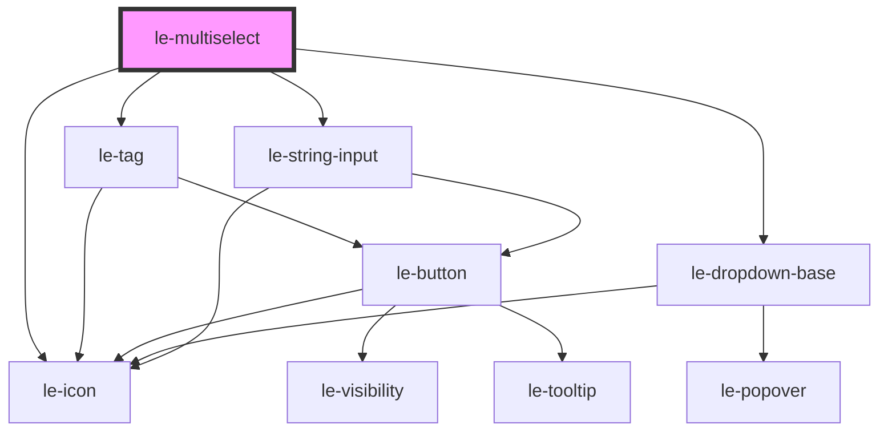

# le-multiselect

<!-- Auto Generated Below -->

## Overview

A multiselect component for selecting multiple options.

Displays selected items as tags with optional search filtering.

## Properties

| Property            | Attribute             | Description                                                                                                            | Type                             | Default               |
| ------------------- | --------------------- | ---------------------------------------------------------------------------------------------------------------------- | -------------------------------- | --------------------- |
| `autoWidth`         | `auto-width`          | Whether the dropdown width should size automatically to its content rather than matching the trigger width.            | `boolean`                        | `false`               |
| `disabled`          | `disabled`            | Whether the multiselect is disabled.                                                                                   | `boolean`                        | `false`               |
| `emptyText`         | `empty-text`          | Text to show when no options match the search.                                                                         | `string`                         | `'No results found'`  |
| `fullWidth`         | `full-width`          | Whether the multiselect should take full width of its container.                                                       | `boolean`                        | `false`               |
| `matchTriggerWidth` | `match-trigger-width` | Whether the dropdown should match the trigger width. Defaults to true. Setting autoWidth=true overrides this to false. | `boolean`                        | `true`                |
| `maxSelections`     | `max-selections`      | Maximum number of selections allowed.                                                                                  | `number \| undefined`            | `undefined`           |
| `name`              | `name`                | Name attribute for form submission.                                                                                    | `string \| undefined`            | `undefined`           |
| `open`              | `open`                | Whether the dropdown is currently open.                                                                                | `boolean`                        | `false`               |
| `options`           | `options`             | The options to display in the dropdown.                                                                                | `LeOption[] \| string`           | `[]`                  |
| `placeholder`       | `placeholder`         | Placeholder text when no options are selected.                                                                         | `string`                         | `'Select options...'` |
| `required`          | `required`            | Whether selection is required.                                                                                         | `boolean`                        | `false`               |
| `searchable`        | `searchable`          | Whether the input is searchable.                                                                                       | `boolean`                        | `false`               |
| `showSelectAll`     | `show-select-all`     | Whether to show a "Select All" option. Also accepts a string or array of strings to customize the label(s).            | `boolean \| string \| string[]`  | `false`               |
| `size`              | `size`                | Size variant of the multiselect.                                                                                       | `"large" \| "medium" \| "small"` | `'medium'`            |
| `value`             | --                    | The currently selected values.                                                                                         | `LeOptionValue[]`                | `[]`                  |

## Events

| Event      | Description                              | Type                                     |
| ---------- | ---------------------------------------- | ---------------------------------------- |
| `leChange` | Emitted when the selected values change. | `CustomEvent<LeMultiOptionSelectDetail>` |
| `leClose`  | Emitted when the dropdown closes.        | `CustomEvent<void>`                      |
| `leOpen`   | Emitted when the dropdown opens.         | `CustomEvent<void>`                      |

## Methods

### `clearSelection() => Promise<void>`

Clears all selections.

#### Returns

Type: `Promise<void>`

### `hideDropdown() => Promise<void>`

Closes the dropdown.

#### Returns

Type: `Promise<void>`

### `showDropdown() => Promise<void>`

Opens the dropdown.

#### Returns

Type: `Promise<void>`

## Dependencies

### Depends on

- [le-tag](../le-tag)
- [le-dropdown-base](../le-dropdown-base)
- [le-icon](../le-icon)
- [le-string-input](../le-string-input)

### Graph

----------------------------------------------

*Built with [StencilJS](https://stenciljs.com/)*
