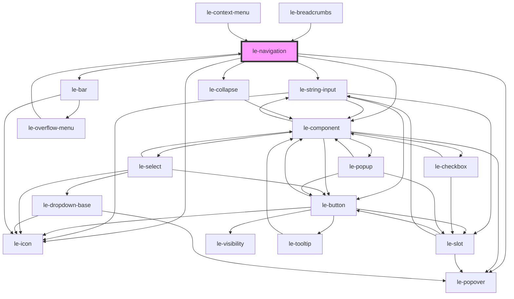

# le-navigation

<!-- Auto Generated Below -->

## Overview

Navigation component with vertical (tree) and horizontal (menu) layouts.

- Accepts items as `LeOption[]` or a JSON string.
- Supports hierarchical items via `children`.
- Supports persisted expansion via `open` on items.

## Properties

| Property                 | Attribute                    | Description                                                                                                                                                                                                                                                                                                       | Type                                               | Default                                                   |
| ------------------------ | ---------------------------- | ----------------------------------------------------------------------------------------------------------------------------------------------------------------------------------------------------------------------------------------------------------------------------------------------------------------- | -------------------------------------------------- | --------------------------------------------------------- |
| `activationMode`         | `activation-mode`            | Whether keyboard focus only highlights, or also activates immediately.                                                                                                                                                                                                                                            | `"automatic" \| "manual"`                          | `'manual'`                                                |
| `activeUrl`              | `active-url`                 | Active url for automatic selection.                                                                                                                                                                                                                                                                               | `string`                                           | `''`                                                      |
| `align`                  | `align`                      | Alignment of the menu items within the navigation bar.                                                                                                                                                                                                                                                            | `"center" \| "end" \| "space-between" \| "start"`  | `'start'`                                                 |
| `autoScroll`             | `auto-scroll`                | Automatically scroll the active item into view when the active URL changes or on initial load.  - Initial load: instant (no animation) - Subsequent `activeUrl` changes: smooth  Only applies to `vertical` orientation.                                                                                          | `boolean`                                          | `false`                                                   |
| `emptyText`              | `empty-text`                 | Text shown when no items match the filter.                                                                                                                                                                                                                                                                        | `string`                                           | `'No results found'`                                      |
| `items`                  | `items`                      | Navigation items. Can be passed as an array or JSON string (same pattern as le-select).                                                                                                                                                                                                                           | `LeOption[] \| string`                             | `[]`                                                      |
| `minVisibleItemsForMore` | `min-visible-items-for-more` | Minimum number of visible top-level items required to use the "More" overflow. If fewer would be visible, the navigation falls back to hamburger.                                                                                                                                                                 | `number`                                           | `2`                                                       |
| `orientation`            | `orientation`                | Layout orientation.                                                                                                                                                                                                                                                                                               | `"horizontal" \| "vertical"`                       | `'horizontal'`                                            |
| `overflowMode`           | `overflow-mode`              | Overflow behavior for horizontal, non-wrapping menus. - more: moves overflow items into a "More" popover - hamburger: turns the whole nav into a hamburger popover                                                                                                                                                | `"hamburger" \| "more"`                            | `'more'`                                                  |
| `reorder`                | `reorder`                    | Enables manual drag-and-drop reordering of navigation items. - 'none': Disabled (default) - 'siblings': Can only reorder within current parent/root siblings - 'nested': Can reorder across hierarchical levels (inside/outside parents) Note: Can also be passed as boolean (true -> 'nested', false -> 'none'). | `"nested" \| "none" \| "siblings" \| boolean`      | `'none'`                                                  |
| `reorderExpandDelay`     | `reorder-expand-delay`       | Delay in ms before automatically expanding a hovered collapsed item during drag-and-drop.                                                                                                                                                                                                                         | `number`                                           | `500`                                                     |
| `reorderRatios`          | --                           | Configurable position target ratios for top (before), middle (inside), and bottom (after) drop zones. Default: { top: 0.3, middle: 0.4, bottom: 0.3 } (30% before / 40% inside / 30% after).                                                                                                                      | `{ top: number; middle: number; bottom: number; }` | `{     top: 0.35,     middle: 0.3,     bottom: 0.35,   }` |
| `searchPlaceholder`      | `search-placeholder`         | Placeholder text for the search input.                                                                                                                                                                                                                                                                            | `string`                                           | `'Search...'`                                             |
| `searchable`             | `searchable`                 | Enables a search input for the vertical navigation.                                                                                                                                                                                                                                                               | `boolean`                                          | `false`                                                   |
| `showReorderHandle`      | `show-reorder-handle`        | Whether to show the drag handle icon (`reorder-horizontal`) at the end of reorderable items. Default: false.                                                                                                                                                                                                      | `boolean`                                          | `false`                                                   |
| `submenuSearchable`      | `submenu-searchable`         | Whether submenu popovers should include a filter input.                                                                                                                                                                                                                                                           | `boolean`                                          | `false`                                                   |
| `togglePosition`         | `toggle-position`            | Position of the toggle arrow for items with children: 'start' \| 'end'                                                                                                                                                                                                                                            | `"end" \| "start"`                                 | `'start'`                                                 |
| `wrap`                   | `wrap`                       | Horizontal wrapping behavior. If false, overflow behavior depends on `overflowMode`.                                                                                                                                                                                                                              | `boolean`                                          | `false`                                                   |

## Events

| Event              | Description                                                                                                                                                             | Type                                         |
| ------------------ | ----------------------------------------------------------------------------------------------------------------------------------------------------------------------- | -------------------------------------------- |
| `leNavItemReorder` | Fired when navigation items are reordered via drag and drop.                                                                                                            | `CustomEvent<LeNavigationItemReorderDetail>` |
| `leNavItemSelect`  | Fired when a navigation item is activated.  This event is cancelable. Call `event.preventDefault()` to prevent default browser navigation and implement custom routing. | `CustomEvent<LeNavigationItemSelectDetail>`  |
| `leNavItemToggle`  | Fired when a tree branch is toggled.                                                                                                                                    | `CustomEvent<LeNavigationItemToggleDetail>`  |
| `leReorder`        | Alias for `leNavItemReorder`.                                                                                                                                           | `CustomEvent<LeNavigationItemReorderDetail>` |

## Methods

### `disableReorder() => Promise<void>`

Programmatically disable reordering.

#### Returns

Type: `Promise<void>`

### `enableReorder(mode?: LeNavigationReorderMode) => Promise<void>`

Programmatically enable reordering.

#### Parameters

| Name   | Type                               | Description |
| ------ | ---------------------------------- | ----------- |
| `mode` | `"none" \| "siblings" \| "nested"` |             |

#### Returns

Type: `Promise<void>`

### `focusActiveItem() => Promise<void>`

#### Returns

Type: `Promise<void>`

### `focusFirstItem() => Promise<void>`

#### Returns

Type: `Promise<void>`

### `moveItem(draggedQuery: string, targetQuery: string, position?: "before" | "inside" | "after") => Promise<{ success: boolean; detail?: LeNavigationItemReorderDetail; }>`

Programmatically move an item relative to another item in the navigation tree.
Accepts item ID, value, or label for both dragged and target items.

#### Parameters

| Name           | Type                              | Description |
| -------------- | --------------------------------- | ----------- |
| `draggedQuery` | `string`                          |             |
| `targetQuery`  | `string`                          |             |
| `position`     | `"after" \| "before" \| "inside"` |             |

#### Returns

Type: `Promise<{ success: boolean; detail?: LeNavigationItemReorderDetail | undefined; }>`

### `setReorder(mode: LeNavigationReorderMode | boolean) => Promise<void>`

Programmatically set the reorder mode ('none', 'siblings', 'nested', or boolean).

#### Parameters

| Name   | Type                                 | Description |
| ------ | ------------------------------------ | ----------- |
| `mode` | `boolean \| LeNavigationReorderMode` |             |

#### Returns

Type: `Promise<void>`

## Slots

| Slot                  | Description                                      |
| --------------------- | ------------------------------------------------ |
| `"hamburger-trigger"` | Custom trigger contents for the hamburger button |
| `"more-trigger"`      | Custom trigger contents for the "More" button    |

## Dependencies

### Used by

 - [le-breadcrumbs](../le-breadcrumbs)
 - [le-context-menu](../le-context-menu)
 - [le-overflow-menu](../le-overflow-menu)

### Depends on

- [le-icon](../le-icon)
- [le-string-input](../le-string-input)
- [le-collapse](../le-collapse)
- [le-popover](../le-popover)
- [le-bar](../le-bar)
- [le-component](../le-component)

### Graph

----------------------------------------------

*Built with [StencilJS](https://stenciljs.com/)*
