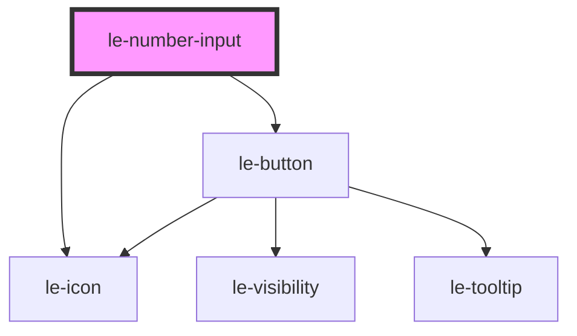

# le-number-input

<!-- Auto Generated Below -->

## Overview

A number input component with validation, keyboard controls, and custom spinners or steppers.

## Properties

| Property          | Attribute          | Description                                                               | Type                               | Default     |
| ----------------- | ------------------ | ------------------------------------------------------------------------- | ---------------------------------- | ----------- |
| `altMultiplier`   | `alt-multiplier`   | Multiplier for step value when holding Alt/Option key                     | `number \| undefined`              | `undefined` |
| `altStep`         | `alt-step`         | Step value when holding Alt/Option key                                    | `number \| undefined`              | `undefined` |
| `controls`        | `controls`         | Controls type for numerical adjustment ('spinner' \| 'stepper' \| 'none') | `"none" \| "spinner" \| "stepper"` | `'none'`    |
| `disabled`        | `disabled`         | Whether the input is disabled                                             | `boolean`                          | `false`     |
| `externalId`      | `external-id`      | External ID for linking with external systems                             | `string \| undefined`              | `undefined` |
| `iconEnd`         | `icon-end`         | Icon for the end icon                                                     | `string \| undefined`              | `undefined` |
| `iconStart`       | `icon-start`       | Icon for the start icon                                                   | `string \| undefined`              | `undefined` |
| `label`           | `label`            | Label for the input                                                       | `string \| undefined`              | `undefined` |
| `max`             | `max`              | Maximum allowed value                                                     | `number \| undefined`              | `undefined` |
| `min`             | `min`              | Minimum allowed value                                                     | `number \| undefined`              | `undefined` |
| `name`            | `name`             | The name of the input                                                     | `string \| undefined`              | `undefined` |
| `placeholder`     | `placeholder`      | Placeholder text                                                          | `string \| undefined`              | `undefined` |
| `readonly`        | `readonly`         | Whether the input is read-only                                            | `boolean`                          | `false`     |
| `required`        | `required`         | Whether the input is required                                             | `boolean`                          | `false`     |
| `shiftMultiplier` | `shift-multiplier` | Multiplier for step value when holding Shift key                          | `number \| undefined`              | `undefined` |
| `shiftStep`       | `shift-step`       | Step value when holding Shift key                                         | `number \| undefined`              | `undefined` |
| `step`            | `step`             | Step value for increment/decrement                                        | `number`                           | `1`         |
| `value`           | `value`            | The value of the input                                                    | `number \| undefined`              | `undefined` |

## Events

| Event      | Description                                              | Type                                                                                                                            |
| ---------- | -------------------------------------------------------- | ------------------------------------------------------------------------------------------------------------------------------- |
| `leChange` | Emitted when the value changes (on blur or Enter)        | `CustomEvent<{ value?: number \| undefined; name?: string \| undefined; externalId?: string \| undefined; isValid: boolean; }>` |
| `leInput`  | Emitted when the input value changes (on keystroke/spin) | `CustomEvent<{ value?: number \| undefined; name?: string \| undefined; externalId?: string \| undefined; isValid: boolean; }>` |

## Slots

| Slot            | Description                                           |
| --------------- | ----------------------------------------------------- |
|                 | The label text for the input                          |
| `"description"` | Additional description text displayed below the input |
| `"icon-end"`    | Icon to display at the end of the input               |
| `"icon-start"`  | Icon to display at the start of the input             |

## Shadow Parts

| Part           | Description |
| -------------- | ----------- |
| `"icon-end"`   |             |
| `"icon-start"` |             |
| `"input"`      |             |

## Dependencies

### Depends on

- [le-icon](../le-icon)
- [le-button](../le-button)

### Graph

----------------------------------------------

*Built with [StencilJS](https://stenciljs.com/)*
