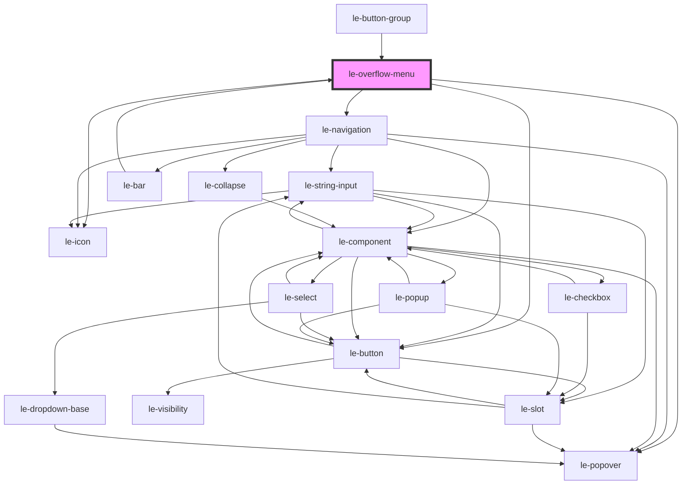

# le-overflow-menu

<!-- Auto Generated Below -->

## Properties

| Property           | Attribute            | Description                                | Type                                     | Default                 |
| ------------------ | -------------------- | ------------------------------------------ | ---------------------------------------- | ----------------------- |
| `align`            | `align`              | Popover alignment relative to trigger.     | `"center" \| "end" \| "start"`           | `'end'`                 |
| `disabled`         | `disabled`           | Disables trigger interactions.             | `boolean`                                | `false`                 |
| `icon`             | `icon`               | Fallback icon name for trigger.            | `string`                                 | `'ellipsis-horizontal'` |
| `items`            | `items`              | List of menu items represented as options. | `LeOption[] \| string`                   | `[]`                    |
| `minWidth`         | `min-width`          | Minimum popover width.                     | `string`                                 | `'200px'`               |
| `offset`           | `offset`             | Popover offset in px.                      | `number`                                 | `8`                     |
| `open`             | `open`               | Whether the menu popover is open.          | `boolean`                                | `false`                 |
| `position`         | `position`           | Popover position.                          | `"bottom" \| "left" \| "right" \| "top"` | `'bottom'`              |
| `triggerAriaLabel` | `trigger-aria-label` | Aria label for fallback trigger button.    | `string`                                 | `'Open menu'`           |
| `triggerPart`      | `trigger-part`       | Part name for fallback trigger button.     | `string`                                 | `'trigger-button'`      |

## Events

| Event                      | Description | Type                                          |
| -------------------------- | ----------- | --------------------------------------------- |
| `leOverflowMenuClose`      |             | `CustomEvent<void>`                           |
| `leOverflowMenuItemSelect` |             | `CustomEvent<LeOverflowMenuItemSelectDetail>` |

## Methods

### `hide() => Promise<void>`

#### Returns

Type: `Promise<void>`

### `show() => Promise<void>`

#### Returns

Type: `Promise<void>`

### `toggle() => Promise<void>`

#### Returns

Type: `Promise<void>`

## Shadow Parts

| Part        | Description |
| ----------- | ----------- |
| `"trigger"` |             |

## Dependencies

### Used by

 - [le-bar](../le-bar)
 - [le-button-group](../le-button-group)

### Depends on

- [le-navigation](../le-navigation)
- [le-popover](../le-popover)
- [le-button](../le-button)
- [le-icon](../le-icon)

### Graph

----------------------------------------------

*Built with [StencilJS](https://stenciljs.com/)*
