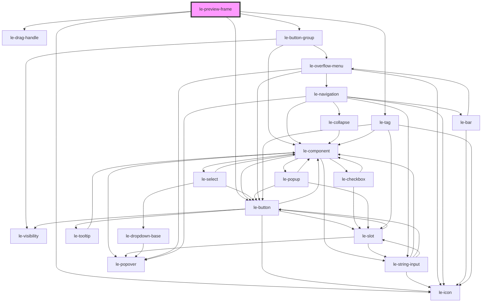

# le-preview-frame

<!-- Auto Generated Below -->

## Overview

A resizable preview frame for showcasing responsive component behavior.

Wraps any content in a resizable viewport, complete with drag handle,
width indicator, and preset device-size buttons. Designed for use in
component demos and documentation.

## Properties

| Property       | Attribute       | Description                                                                                                                                                                                           | Type                                   | Default               |
| -------------- | --------------- | ----------------------------------------------------------------------------------------------------------------------------------------------------------------------------------------------------- | -------------------------------------- | --------------------- |
| `breakpoints`  | `breakpoints`   | Preset breakpoints shown as buttons. Can be a JSON string or a LePreviewFrameBreakpoint[].                                                                                                            | `LePreviewFrameBreakpoint[] \| string` | `DEFAULT_BREAKPOINTS` |
| `frameWidth`   | `frame-width`   | Initial inner width of the preview viewport in pixels. Set to 0 or 'auto' to fill the available container width.                                                                                      | `number \| undefined`                  | `undefined`           |
| `handles`      | `handles`       | Which handles are rendered. Accepts "right", "left", "bottom", "left,right", etc. or a JSON string/array.                                                                                             | `LePreviewFrameHandleSide[] \| string` | `'right'`             |
| `maxHeight`    | `max-height`    | Maximum resizable viewport height in pixels. 0 = unconstrained.                                                                                                                                       | `number`                               | `0`                   |
| `maxWidth`     | `max-width`     | Maximum resizable width in pixels. 0 = unconstrained.                                                                                                                                                 | `number`                               | `0`                   |
| `minHeight`    | `min-height`    | Minimum height of the viewport in pixels.                                                                                                                                                             | `number`                               | `64`                  |
| `minWidth`     | `min-width`     | Minimum resizable width in pixels.                                                                                                                                                                    | `number`                               | `240`                 |
| `origin`       | `origin`        | Horizontal resize origin strategy. - auto: detects centered layouts and switches to center math - edge: keeps opposite edge fixed (default left-aligned behavior) - center: grows/shrinks from center | `"auto" \| "center" \| "edge"`         | `'auto'`              |
| `padding`      | `padding`       | Extra layout padding to subtract from available container space. Useful when visual page padding is not detectable from the immediate parent.                                                         | `number`                               | `0`                   |
| `resizable`    | `resizable`     | Whether to show drag resize handles.                                                                                                                                                                  | `boolean`                              | `true`                |
| `showControls` | `show-controls` | Whether to show the controls bar (breakpoint buttons + width badge).                                                                                                                                  | `boolean`                              | `true`                |
| `widthUnit`    | `width-unit`    | Label for the width badge. Set empty to hide the unit suffix.                                                                                                                                         | `string`                               | `'px'`                |

## Events

| Event                  | Description                                                       | Type                                      |
| ---------------------- | ----------------------------------------------------------------- | ----------------------------------------- |
| `lePreviewFrameResize` | Emitted whenever the frame width changes (drag or preset button). | `CustomEvent<LePreviewFrameResizeDetail>` |

## Methods

### `resetWidth() => Promise<void>`

Reset to natural/container width.

#### Returns

Type: `Promise<void>`

### `snapTo(width: number) => Promise<void>`

Snap to a preset width.

#### Parameters

| Name    | Type     | Description |
| ------- | -------- | ----------- |
| `width` | `number` |             |

#### Returns

Type: `Promise<void>`

## Slots

| Slot         | Description                                     |
| ------------ | ----------------------------------------------- |
|              | The content to preview                          |
| `"controls"` | Extra content inserted after the preset buttons |

## Shadow Parts

| Part         | Description |
| ------------ | ----------- |
| `"controls"` |             |
| `"frame"`    |             |
| `"viewport"` |             |

## Dependencies

### Depends on

- [le-drag-handle](../le-drag-handle)
- [le-button-group](../le-button-group)
- [le-button](../le-button)
- [le-icon](../le-icon)
- [le-tag](../le-tag)

### Graph

----------------------------------------------

*Built with [StencilJS](https://stenciljs.com/)*
