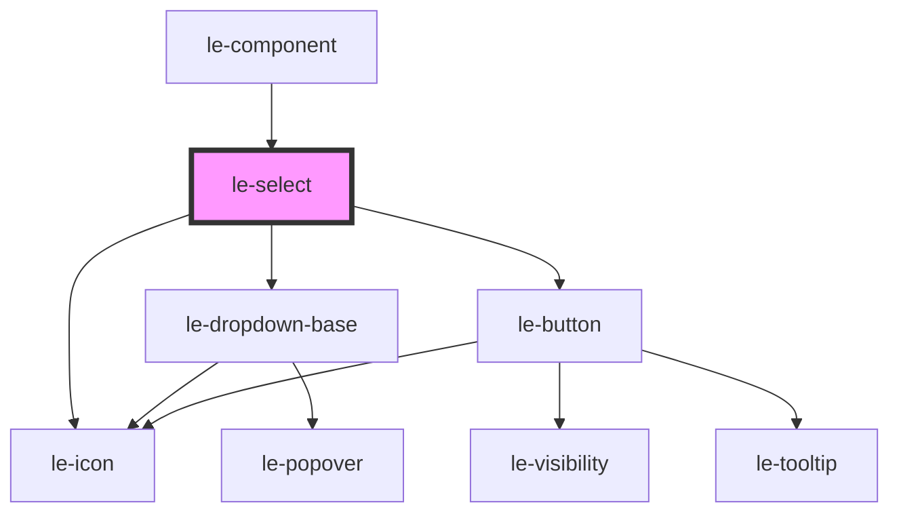

# le-select

<!-- Auto Generated Below -->

## Overview

A select dropdown component for single selection.

## Properties

| Property            | Attribute             | Description                                                                                                                            | Type                                            | Default              |
| ------------------- | --------------------- | -------------------------------------------------------------------------------------------------------------------------------------- | ----------------------------------------------- | -------------------- |
| `autoWidth`         | `auto-width`          | Whether the dropdown width should size automatically to its content rather than matching the trigger width. Defaults to false.         | `boolean`                                       | `false`              |
| `chevron`           | `chevron`             | Custom chevron icon name or text.                                                                                                      | `string \| undefined`                           | `undefined`          |
| `compact`           | `compact`             | Compact mode shortcut: sets size="small", variant="clear", hideChevron=true, and autoWidth=true.                                       | `boolean`                                       | `false`              |
| `disabled`          | `disabled`            | Whether the select is disabled.                                                                                                        | `boolean`                                       | `false`              |
| `fullWidth`         | `full-width`          | Whether the select should take full width of its container.                                                                            | `boolean`                                       | `false`              |
| `hideChevron`       | `hide-chevron`        | Whether to hide the chevron icon completely.                                                                                           | `boolean`                                       | `false`              |
| `matchTriggerWidth` | `match-trigger-width` | Whether the dropdown should match the trigger width. Defaults to true. Setting autoWidth=true or compact=true overrides this to false. | `boolean`                                       | `true`               |
| `name`              | `name`                | Name attribute for form submission.                                                                                                    | `string \| undefined`                           | `undefined`          |
| `open`              | `open`                | Whether the dropdown is currently open.                                                                                                | `boolean`                                       | `false`              |
| `options`           | `options`             | The options to display in the dropdown.                                                                                                | `LeOption[] \| string`                          | `[]`                 |
| `placeholder`       | `placeholder`         | Placeholder text when no option is selected.                                                                                           | `string`                                        | `'Select an option'` |
| `required`          | `required`            | Whether selection is required.                                                                                                         | `boolean`                                       | `false`              |
| `size`              | `size`                | Size variant of the select.                                                                                                            | `"large" \| "medium" \| "small"`                | `'medium'`           |
| `value`             | `value`               | The currently selected value.                                                                                                          | `number \| string \| undefined`                 | `undefined`          |
| `variant`           | `variant`             | Visual variant of the select.                                                                                                          | `"clear" \| "default" \| "outlined" \| "solid"` | `'default'`          |

## Events

| Event      | Description                              | Type                                |
| ---------- | ---------------------------------------- | ----------------------------------- |
| `leChange` | Emitted when the selected value changes. | `CustomEvent<LeOptionSelectDetail>` |
| `leClose`  | Emitted when the dropdown closes.        | `CustomEvent<void>`                 |
| `leOpen`   | Emitted when the dropdown opens.         | `CustomEvent<void>`                 |

## Methods

### `hideDropdown() => Promise<void>`

Closes the dropdown.

#### Returns

Type: `Promise<void>`

### `showDropdown() => Promise<void>`

Opens the dropdown.

#### Returns

Type: `Promise<void>`

## Slots

| Slot        | Description                                                     |
| ----------- | --------------------------------------------------------------- |
| `"chevron"` | Custom chevron icon to display at the end of the select trigger |

## Dependencies

### Used by

 - [le-component](../le-component)

### Depends on

- [le-icon](../le-icon)
- [le-dropdown-base](../le-dropdown-base)
- [le-button](../le-button)

### Graph

----------------------------------------------

*Built with [StencilJS](https://stenciljs.com/)*
