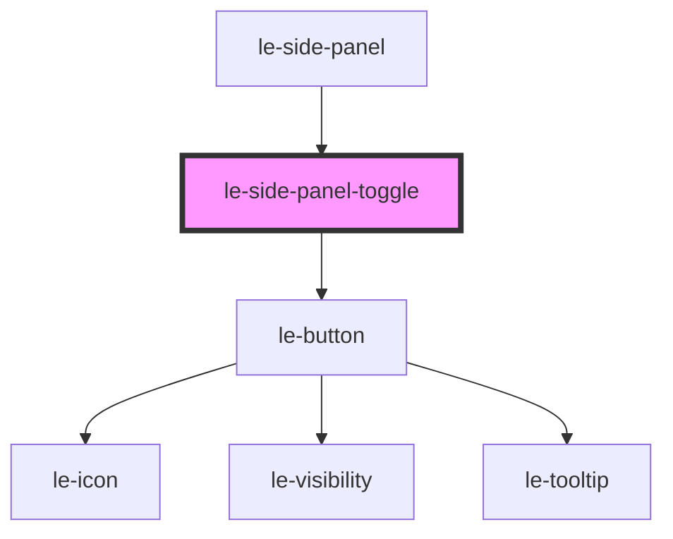

# le-side-panel-toggle

<!-- Auto Generated Below -->

## Properties

| Property    | Attribute    | Description                                         | Type                                                                       | Default     |
| ----------- | ------------ | --------------------------------------------------- | -------------------------------------------------------------------------- | ----------- |
| `action`    | `action`     | Action to emit. Default toggles the panel.          | `"close" \| "open" \| "toggle"`                                            | `'toggle'`  |
| `align`     | `align`      |                                                     | `"center" \| "end" \| "space-between" \| "start"`                          | `'center'`  |
| `color`     | `color`      |                                                     | `"danger" \| "info" \| "primary" \| "secondary" \| "success" \| "warning"` | `'primary'` |
| `disabled`  | `disabled`   | Disables the toggle.                                | `boolean`                                                                  | `false`     |
| `fullWidth` | `full-width` |                                                     | `boolean`                                                                  | `false`     |
| `href`      | `href`       |                                                     | `string \| undefined`                                                      | `undefined` |
| `iconEnd`   | `icon-end`   |                                                     | `Node \| string \| undefined`                                              | `undefined` |
| `iconOnly`  | `icon-only`  |                                                     | `Node \| string \| undefined`                                              | `undefined` |
| `iconStart` | `icon-start` |                                                     | `Node \| string \| undefined`                                              | `undefined` |
| `mode`      | `mode`       |                                                     | `"admin" \| "default"`                                                     | `'default'` |
| `panelId`   | `panel-id`   | Optional id used to target a specific panel.        | `string \| undefined`                                                      | `undefined` |
| `selected`  | `selected`   |                                                     | `boolean`                                                                  | `false`     |
| `shortcut`  | `shortcut`   | Optional keyboard shortcut like `Mod+B` or `Alt+N`. | `string \| undefined`                                                      | `undefined` |
| `size`      | `size`       |                                                     | `"large" \| "medium" \| "small"`                                           | `'medium'`  |
| `target`    | `target`     |                                                     | `string \| undefined`                                                      | `undefined` |
| `type`      | `type`       |                                                     | `"button" \| "reset" \| "submit"`                                          | `'button'`  |
| `variant`   | `variant`    |                                                     | `"clear" \| "outlined" \| "solid" \| "system"`                             | `'solid'`   |

## Events

| Event                      | Description | Type                                                                               |
| -------------------------- | ----------- | ---------------------------------------------------------------------------------- |
| `leSidePanelRequestToggle` |             | `CustomEvent<{ panelId?: string \| undefined; action: LeSidePanelToggleAction; }>` |

## Dependencies

### Used by

 - [le-side-panel](../le-side-panel)

### Depends on

- [le-button](../le-button)

### Graph

----------------------------------------------

*Built with [StencilJS](https://stenciljs.com/)*
