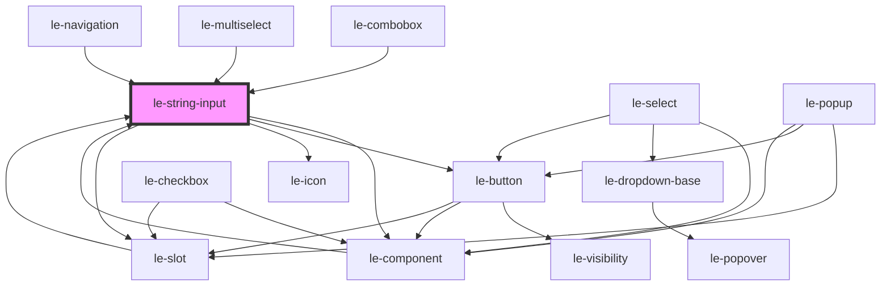

# le-string-input

<!-- Auto Generated Below -->

## Overview

A text input component with support for labels, descriptions, icons, and external IDs.

## Properties

| Property       | Attribute      | Description                                                   | Type                                                            | Default     |
| -------------- | -------------- | ------------------------------------------------------------- | --------------------------------------------------------------- | ----------- |
| `autocomplete` | `autocomplete` | Native autocomplete attribute forwarded to the input          | `string \| undefined`                                           | `undefined` |
| `clearable`    | `clearable`    | Whether the input can be cleared with a built-in clear button | `boolean`                                                       | `false`     |
| `description`  | `description`  | Description text displayed below the input                    | `string \| undefined`                                           | `undefined` |
| `disabled`     | `disabled`     | Whether the input is disabled                                 | `boolean`                                                       | `false`     |
| `externalId`   | `external-id`  | External ID for linking with external systems                 | `string \| undefined`                                           | `undefined` |
| `iconEnd`      | `icon-end`     | Icon for the end icon                                         | `string \| undefined`                                           | `undefined` |
| `iconStart`    | `icon-start`   | Icon for the start icon                                       | `string \| undefined`                                           | `undefined` |
| `inputRef`     | --             | Pass the ref of the input element to the parent component     | `((el: HTMLInputElement) => void) \| undefined`                 | `undefined` |
| `label`        | `label`        | Label for the input                                           | `string \| undefined`                                           | `undefined` |
| `mode`         | `mode`         | Mode of the popover should be 'default' for internal use      | `"admin" \| "default" \| undefined`                             | `undefined` |
| `name`         | `name`         | The name of the input                                         | `string \| undefined`                                           | `undefined` |
| `placeholder`  | `placeholder`  | Placeholder text                                              | `string \| undefined`                                           | `undefined` |
| `readonly`     | `readonly`     | Whether the input is read-only                                | `boolean`                                                       | `false`     |
| `type`         | `type`         | The type of the input (text, email, password, etc.)           | `"email" \| "password" \| "search" \| "tel" \| "text" \| "url"` | `'text'`    |
| `value`        | `value`        | The value of the input                                        | `string \| undefined`                                           | `undefined` |

## Events

| Event      | Description                                         | Type                                                                                                          |
| ---------- | --------------------------------------------------- | ------------------------------------------------------------------------------------------------------------- |
| `leChange` | Emitted when the value changes (on blur or Enter)   | `CustomEvent<{ value?: string \| undefined; name?: string \| undefined; externalId?: string \| undefined; }>` |
| `leInput`  | Emitted when the input value changes (on keystroke) | `CustomEvent<{ value?: string \| undefined; name?: string \| undefined; externalId?: string \| undefined; }>` |

## Slots

| Slot            | Description                                           |
| --------------- | ----------------------------------------------------- |
| `"description"` | Additional description text displayed below the input |
| `"icon-end"`    | Icon to display at the end of the input               |
| `"icon-start"`  | Icon to display at the start of the input             |
| `"label"`       | The label content for the input                       |

## Shadow Parts

| Part          | Description |
| ------------- | ----------- |
| `"container"` |             |

## Dependencies

### Used by

 - [le-combobox](../le-combobox)
 - [le-component](../le-component)
 - [le-multiselect](../le-multiselect)
 - [le-navigation](../le-navigation)
 - [le-slot](../le-slot)

### Depends on

- [le-component](../le-component)
- [le-button](../le-button)
- [le-icon](../le-icon)
- [le-slot](../le-slot)

### Graph

----------------------------------------------

*Built with [StencilJS](https://stenciljs.com/)*
