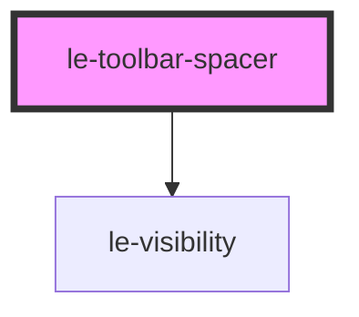

# le-toolbar-spacer

<!-- Auto Generated Below -->

## Overview

Flexible spacer for le-toolbar layouts.

Default behavior (no width): occupies available free space and shrinks naturally.
With numeric `width`: behaves as a fixed-width spacer that can be collapsed by le-toolbar.

## Properties

| Property     | Attribute    | Description                                                                   | Type                                                      | Default     |
| ------------ | ------------ | ----------------------------------------------------------------------------- | --------------------------------------------------------- | ----------- |
| `visibility` | `visibility` | Visibility state controlled by responsive containers such as le-toolbar.      | `"collapsed" \| "collapsing" \| "expanding" \| "visible"` | `'visible'` |
| `width`      | `width`      | Optional fixed width in pixels. Numeric values (e.g. `24`) are treated as px. | `number \| string \| undefined`                           | `undefined` |

## Shadow Parts

| Part       | Description |
| ---------- | ----------- |
| `"spacer"` |             |

## Dependencies

### Depends on

- [le-visibility](../le-visibility)

### Graph

----------------------------------------------

*Built with [StencilJS](https://stenciljs.com/)*
