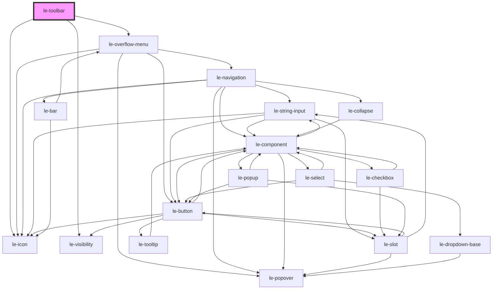

# le-toolbar

<!-- Auto Generated Below -->

## Overview

A priority-aware, overflow-safe toolbar component.

Items are slotted light-DOM children. Each item may carry a
`priority` attribute (lower = more important). When there
isn't enough space, lower-priority items move to an overflow menu.

Collapsible `le-button-group` children are asked to reduce their own
footprint first before their contents are overflowed entirely.

## Properties

| Property                  | Attribute                    | Description                                                                                                                                                                | Type                                        | Default                                             |
| ------------------------- | ---------------------------- | -------------------------------------------------------------------------------------------------------------------------------------------------------------------------- | ------------------------------------------- | --------------------------------------------------- |
| `alignItems`              | `align-items`                | Alignment of items along the main axis.                                                                                                                                    | `"center" \| "end" \| "start" \| "stretch"` | `'start'`                                           |
| `debugPauseBeforeMeasure` | `debug-pause-before-measure` | Temporary debug mode: stop before measuring virtual widths so the virtual DOM can be inspected before collapse simulation mutates it.                                      | `boolean`                                   | `false`                                             |
| `debugVirtualToolbar`     | `debug-virtual-toolbar`      | Temporary debug mode: render the virtual toolbar visibly above the live toolbar so collapse measurements can be inspected.                                                 | `boolean`                                   | `false`                                             |
| `disablePopover`          | `disable-popover`            | Disable the built-in overflow popover. The toolbar will still compute overflow state and emit events, but won't render its own menu. Useful for custom overflow handling.  | `boolean`                                   | `false`                                             |
| `itemGap`                 | `item-gap`                   | Spacing between top-level toolbar items. Accepts any valid CSS length (e.g. `8px`, `0.5rem`, `var(--le-spacing-2)`).                                                       | `string`                                    | `'var(--le-toolbar-gap, var(--le-spacing-1, 4px))'` |
| `items`                   | --                           | Optional declarative items input.  The current implementation is slot-driven, but when this prop changes we still invalidate the slotted-items cache and recompute layout. | `unknown`                                   | `undefined`                                         |
| `overflowIcon`            | `overflow-icon`              | Icon for the overflow trigger button when no custom slot content is provided.                                                                                              | `string`                                    | `'ellipsis-horizontal'`                             |
| `overflowLabel`           | `overflow-label`             | Accessible label for the overflow trigger button.                                                                                                                          | `string`                                    | `'More'`                                            |

## Events

| Event                     | Description                              | Type                                         |
| ------------------------- | ---------------------------------------- | -------------------------------------------- |
| `leToolbarOverflowChange` | Emitted when the overflow state changes. | `CustomEvent<LeToolbarOverflowChangeDetail>` |

## Methods

### `recalculate() => Promise<void>`

Force a layout recalculation.

#### Returns

Type: `Promise<void>`

### `resetToolbar() => Promise<void>`

Reset the toolbar's internal layout state and recalculate item visibility from scratch.

#### Returns

Type: `Promise<void>`

### `runDebugMeasurementStep() => Promise<void>`

#### Returns

Type: `Promise<void>`

## Slots

| Slot     | Description                                    |
| -------- | ---------------------------------------------- |
|          | Toolbar items                                  |
| `"more"` | Custom content for the overflow trigger button |

## Shadow Parts

| Part                 | Description |
| -------------------- | ----------- |
| `"container"`        |             |
| `"overflow-trigger"` |             |

## Dependencies

### Depends on

- [le-icon](../le-icon)
- [le-visibility](../le-visibility)
- [le-overflow-menu](../le-overflow-menu)

### Graph

----------------------------------------------

*Built with [StencilJS](https://stenciljs.com/)*
