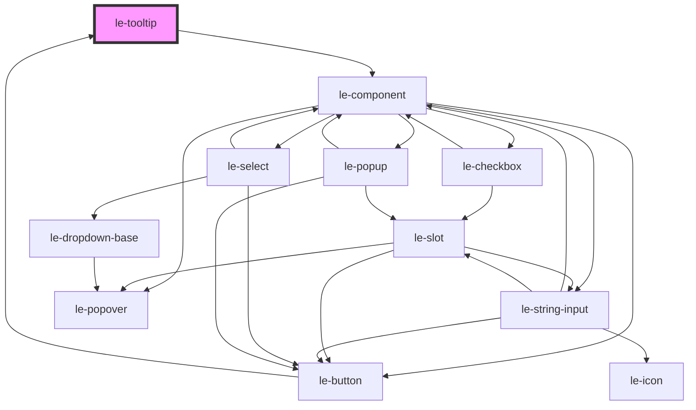

# le-tooltip

<!-- Auto Generated Below -->

## Properties

| Property    | Attribute    | Description                                                                    | Type                                               | Default     |
| ----------- | ------------ | ------------------------------------------------------------------------------ | -------------------------------------------------- | ----------- |
| `align`     | `align`      | Alignment along the cross axis for the chosen placement.                       | `"center" \| "end" \| "start"`                     | `'center'`  |
| `disabled`  | `disabled`   | Disable tooltip interactions and visibility.                                   | `boolean`                                          | `false`     |
| `hideDelay` | `hide-delay` | Delay in milliseconds before hiding the tooltip after leaving trigger/content. | `number`                                           | `160`       |
| `maxWidth`  | `max-width`  | Max width of the tooltip box.                                                  | `string`                                           | `'280px'`   |
| `mode`      | `mode`       | The mode of Le Kit.                                                            | `string`                                           | `'default'` |
| `offset`    | `offset`     | Distance in pixels between trigger and tooltip.                                | `number`                                           | `8`         |
| `open`      | `open`       | Controls whether the tooltip is open.                                          | `boolean`                                          | `false`     |
| `placement` | `placement`  | Preferred tooltip placement relative to trigger.                               | `"auto" \| "bottom" \| "left" \| "right" \| "top"` | `'auto'`    |
| `showDelay` | `show-delay` | Delay in milliseconds before showing the tooltip.                              | `number`                                           | `500`       |
| `text`      | `text`       | Tooltip text shown when no custom content slot is provided.                    | `string`                                           | `''`        |
| `variant`   | `variant`    | Visual variant of tooltip.                                                     | `"danger" \| "default" \| "success"`               | `'default'` |

## Events

| Event            | Description                      | Type                |
| ---------------- | -------------------------------- | ------------------- |
| `leTooltipClose` | Emitted when the tooltip closes. | `CustomEvent<void>` |
| `leTooltipOpen`  | Emitted when the tooltip opens.  | `CustomEvent<void>` |

## Methods

### `hide() => Promise<void>`

Hides the tooltip.

#### Returns

Type: `Promise<void>`

### `show() => Promise<void>`

Shows the tooltip.

#### Returns

Type: `Promise<void>`

### `toggle() => Promise<void>`

Toggles the tooltip.

#### Returns

Type: `Promise<void>`

### `updatePosition() => Promise<void>`

Updates tooltip position manually.

#### Returns

Type: `Promise<void>`

## Shadow Parts

| Part        | Description |
| ----------- | ----------- |
| `"content"` |             |
| `"trigger"` |             |

## Dependencies

### Used by

 - [le-button](../le-button)

### Depends on

- [le-component](../le-component)

### Graph

----------------------------------------------

*Built with [StencilJS](https://stenciljs.com/)*
