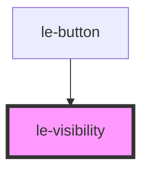

# le-visibility

<!-- Auto Generated Below -->

## Overview

Internal visibility transition controller.

This component controls transition phase + measured size variables.

Preferred usage wraps the target content:
<le-visibility state="collapsed">
...
</le-visibility>

For backward compatibility, when no children are provided it
falls back to controlling the parent host element.

## Properties

| Property | Attribute | Description                                         | Type                            | Default     |
| -------- | --------- | --------------------------------------------------- | ------------------------------- | ----------- |
| `mode`   | `mode`    | Which dimensions to measure and expose as CSS vars. | `"both" \| "height" \| "width"` | `'width'`   |
| `state`  | `state`   | Desired visibility state.                           | `"collapsed" \| "visible"`      | `'visible'` |

## Dependencies

### Used by

 - [le-button](../le-button)

### Graph

----------------------------------------------

*Built with [StencilJS](https://stenciljs.com/)*
