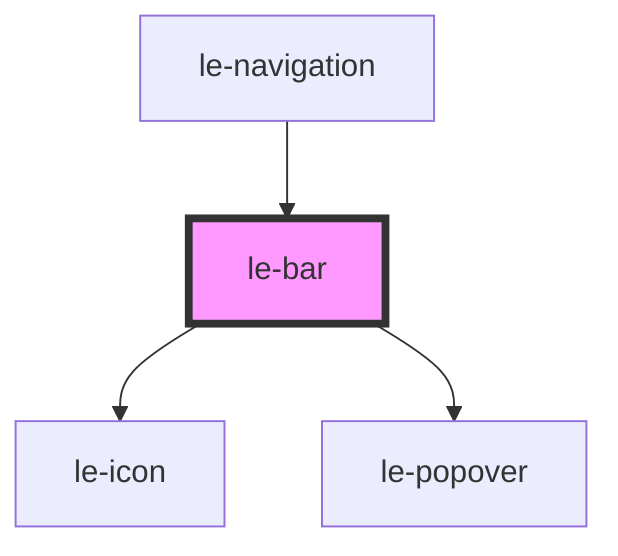

# le-bar

<!-- Auto Generated Below -->

## Overview

A flexible bar component that handles overflow gracefully.

Items are slotted children. The bar measures which items fit on the first
row and handles overflow according to the `overflow` prop.

## Properties

| Property         | Attribute         | Description                                                                                                                                                                                                                                                                  | Type                                          | Default   |
| ---------------- | ----------------- | ---------------------------------------------------------------------------------------------------------------------------------------------------------------------------------------------------------------------------------------------------------------------------- | --------------------------------------------- | --------- |
| `alignItems`     | `align-items`     | Alignment of items within the bar (maps to justify-content).                                                                                                                                                                                                                 | `"center" \| "end" \| "start" \| "stretch"`   | `'start'` |
| `arrows`         | `arrows`          | Show scroll arrows when overflow is "scroll".                                                                                                                                                                                                                                | `boolean`                                     | `false`   |
| `disablePopover` | `disable-popover` | Disable the internal overflow popover. When true, the bar still detects overflow and hides items, but doesn't render its own popover. Use this when providing custom overflow handling via the leBarOverflowChange event.                                                    | `boolean`                                     | `false`   |
| `overflow`       | `overflow`        | Overflow behavior when items don't fit on one row. - `more`: Overflow items appear in a "more" dropdown - `scroll`: Items scroll horizontally with optional arrows - `hamburger`: All items go into a hamburger menu if any overflow - `wrap`: Items wrap to additional rows | `"hamburger" \| "more" \| "scroll" \| "wrap"` | `'more'`  |
| `showAllMenu`    | `show-all-menu`   | Show an "all items" menu button. - `false`: Don't show - `true` or `'end'`: Show at end - `'start'`: Show at start                                                                                                                                                           | `"end" \| "start" \| boolean`                 | `false`   |

## Events

| Event                 | Description                          | Type                                     |
| --------------------- | ------------------------------------ | ---------------------------------------- |
| `leBarOverflowChange` | Emitted when overflow state changes. | `CustomEvent<LeBarOverflowChangeDetail>` |

## Methods

### `recalculate() => Promise<void>`

Force recalculation of overflow state.

#### Returns

Type: `Promise<void>`

## Slots

| Slot            | Description                                        |
| --------------- | -------------------------------------------------- |
|                 | Bar items (children will be measured for overflow) |
| `"all-menu"`    | Custom "show all" menu button                      |
| `"end-arrow"`   | Custom right scroll arrow                          |
| `"hamburger"`   | Custom hamburger button content                    |
| `"more"`        | Custom "more" button content                       |
| `"start-arrow"` | Custom left scroll arrow                           |

## Shadow Parts

| Part                 | Description |
| -------------------- | ----------- |
| `"all-menu-button"`  |             |
| `"arrow-end"`        |             |
| `"arrow-start"`      |             |
| `"container"`        |             |
| `"hamburger-button"` |             |
| `"more-button"`      |             |
| `"popover-content"`  |             |

## Dependencies

### Used by

 - [le-navigation](../le-navigation)

### Depends on

- [le-icon](../le-icon)
- [le-popover](../le-popover)

### Graph

----------------------------------------------

*Built with [StencilJS](https://stenciljs.com/)*
