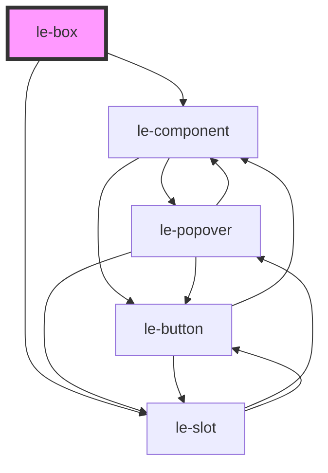

# le-box

<!-- Auto Generated Below -->

## Overview

A flexible box component for use as a flex item within le-stack.

`le-box` wraps content and provides flex item properties like grow, shrink,
basis, and self-alignment. It can also control its internal content alignment.

## Properties

| Property         | Attribute         | Description                                                                       | Type                                                                | Default      |
| ---------------- | ----------------- | --------------------------------------------------------------------------------- | ------------------------------------------------------------------- | ------------ |
| `alignContent`   | `align-content`   | Internal horizontal alignment of content                                          | `"center" \| "end" \| "start" \| "stretch"`                         | `'stretch'`  |
| `alignSelf`      | `align-self`      | Self-alignment override for this item on the cross axis                           | `"auto" \| "baseline" \| "center" \| "end" \| "start" \| "stretch"` | `'auto'`     |
| `basis`          | `basis`           | Flex basis - initial size before growing/shrinking (e.g., '200px', '25%', 'auto') | `string`                                                            | `'auto'`     |
| `displayFlex`    | `display-flex`    | Whether to display box content as flex (for internal alignment)                   | `boolean`                                                           | `false`      |
| `grow`           | `grow`            | Flex grow factor - how much the item should grow relative to siblings             | `number`                                                            | `0`          |
| `height`         | `height`          | Height of the box (CSS value)                                                     | `string`                                                            | `undefined`  |
| `innerDirection` | `inner-direction` | Direction of internal flex layout when displayFlex is true                        | `"horizontal" \| "vertical"`                                        | `'vertical'` |
| `innerGap`       | `inner-gap`       | Gap between internal flex items when displayFlex is true                          | `string`                                                            | `undefined`  |
| `justifyContent` | `justify-content` | Internal vertical alignment of content                                            | `"center" \| "end" \| "start" \| "stretch"`                         | `'start'`    |
| `maxHeight`      | `max-height`      | Maximum height constraint                                                         | `string`                                                            | `undefined`  |
| `maxWidth`       | `max-width`       | Maximum width constraint                                                          | `string`                                                            | `undefined`  |
| `minHeight`      | `min-height`      | Minimum height constraint                                                         | `string`                                                            | `undefined`  |
| `minWidth`       | `min-width`       | Minimum width constraint                                                          | `string`                                                            | `undefined`  |
| `order`          | `order`           | Order in the flex container (lower values come first)                             | `number`                                                            | `undefined`  |
| `padding`        | `padding`         | Padding inside the box (CSS value like '8px', '1rem')                             | `string`                                                            | `undefined`  |
| `shrink`         | `shrink`          | Flex shrink factor - how much the item should shrink relative to siblings         | `number`                                                            | `1`          |
| `width`          | `width`           | Width of the box (CSS value like '100px', '50%', 'auto')                          | `string`                                                            | `undefined`  |

## Slots

| Slot | Description                  |
| ---- | ---------------------------- |
|      | Default slot for box content |

## Shadow Parts

| Part        | Description |
| ----------- | ----------- |
| `"box"`     |             |
| `"content"` |             |

## Dependencies

### Depends on

- [le-component](../le-component)
- [le-slot](../le-slot)

### Graph

----------------------------------------------

*Built with [StencilJS](https://stenciljs.com/)*
