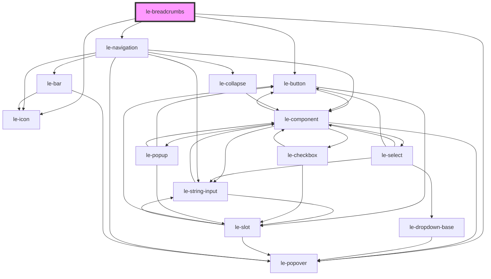

# le-breadcrumbs

<!-- Auto Generated Below -->

## Properties

| Property          | Attribute           | Description                                                  | Type                               | Default           |
| ----------------- | ------------------- | ------------------------------------------------------------ | ---------------------------------- | ----------------- |
| `items`           | `items`             | Breadcrumb items (supports JSON string).                     | `LeOption[] \| string`             | `[]`              |
| `label`           | `label`             | Accessible label for the breadcrumbs navigation.             | `string`                           | `'Breadcrumbs'`   |
| `minVisibleItems` | `min-visible-items` | Minimum visible items before collapsing.                     | `number`                           | `2`               |
| `overflowMode`    | `overflow-mode`     | Overflow behavior: collapse (default), wrap, or scroll.      | `"collapse" \| "scroll" \| "wrap"` | `'collapse'`      |
| `separatorIcon`   | `separator-icon`    | Separator icon name (used if no separator slot is provided). | `string`                           | `'chevron-right'` |

## Events

| Event                | Description                                 | Type                                    |
| -------------------- | ------------------------------------------- | --------------------------------------- |
| `leBreadcrumbSelect` | Emitted when a breadcrumb item is selected. | `CustomEvent<LeBreadcrumbSelectDetail>` |

## Dependencies

### Depends on

- [le-icon](../le-icon)
- [le-button](../le-button)
- [le-popover](../le-popover)
- [le-navigation](../le-navigation)

### Graph

----------------------------------------------

*Built with [StencilJS](https://stenciljs.com/)*
