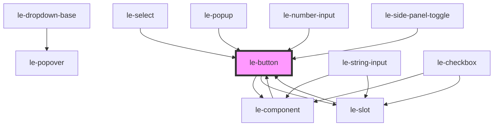

# le-button

A flexible button component with multiple variants, colors, sizes, and states.

## Features

- **Color themes**: Uses semantic colors from the theme (primary, secondary, success, warning, danger, info)
- **Variants**: solid, outlined, clear (ghost)
- **Sizes**: small, medium, large
- **States**: selected, disabled
- **Full width**: Expand to container width
- **Icon support**: icon-only mode, or icons before/after text
- **Link mode**: Can render as an anchor tag with `href`

## Usage

### Basic

```html
<le-button>Click me</le-button>
```

### Colors

```html
<le-button color="primary">Primary</le-button>
<le-button color="secondary">Secondary</le-button>
<le-button color="success">Success</le-button>
<le-button color="warning">Warning</le-button>
<le-button color="danger">Danger</le-button>
<le-button color="info">Info</le-button>
```

### Variants

```html
<le-button variant="solid">Solid</le-button>
<le-button variant="outlined">Outlined</le-button>
<le-button variant="clear">Clear</le-button>
```

### Sizes

```html
<le-button size="small">Small</le-button>
<le-button size="medium">Medium</le-button>
<le-button size="large">Large</le-button>
```

### With Icons

```html
<le-button>
  <svg slot="icon-start">...</svg>
  With Icon
</le-button>

<le-button icon-only>
  <svg slot="icon-start">...</svg>
</le-button>
```

### As Link

```html
<le-button href="https://example.com" target="_blank"> Visit Site </le-button>
```

### Full Width

```html
<le-button full-width>Full Width Button</le-button>
```

<!-- Auto Generated Below -->


## Overview

A flexible button component with multiple variants and states.

## Properties

| Property    | Attribute    | Description                                                                                    | Type                                                                       | Default     |
| ----------- | ------------ | ---------------------------------------------------------------------------------------------- | -------------------------------------------------------------------------- | ----------- |
| `align`     | `align`      | Alignment of the button label without the end icon                                             | `"center" \| "end" \| "space-between" \| "start"`                          | `'center'`  |
| `color`     | `color`      | Button color theme (uses theme semantic colors)                                                | `"danger" \| "info" \| "primary" \| "secondary" \| "success" \| "warning"` | `'primary'` |
| `disabled`  | `disabled`   | Whether the button is disabled                                                                 | `boolean`                                                                  | `false`     |
| `fullWidth` | `full-width` | Whether the button takes full width of its container                                           | `boolean`                                                                  | `false`     |
| `href`      | `href`       | Optional href to make the button act as a link                                                 | `string`                                                                   | `undefined` |
| `iconEnd`   | `icon-end`   | End icon image or emoji                                                                        | `Node \| string`                                                           | `undefined` |
| `iconOnly`  | `icon-only`  | Icon only button image or emoji if this prop is set, the button will render only the icon slot | `Node \| string`                                                           | `undefined` |
| `iconStart` | `icon-start` | Start icon image or emoji                                                                      | `Node \| string`                                                           | `undefined` |
| `mode`      | `mode`       | Mode of the popover should be 'default' for internal use                                       | `"admin" \| "default"`                                                     | `undefined` |
| `selected`  | `selected`   | Whether the button is in a selected/active state                                               | `boolean`                                                                  | `false`     |
| `size`      | `size`       | Button size                                                                                    | `"large" \| "medium" \| "small"`                                           | `'medium'`  |
| `target`    | `target`     | Link target when href is set                                                                   | `string`                                                                   | `undefined` |
| `type`      | `type`       | The button type attribute                                                                      | `"button" \| "reset" \| "submit"`                                          | `'button'`  |
| `variant`   | `variant`    | Button variant style                                                                           | `"clear" \| "outlined" \| "solid" \| "system"`                             | `'solid'`   |


## Events

| Event   | Description                                                                                                                     | Type                      |
| ------- | ------------------------------------------------------------------------------------------------------------------------------- | ------------------------- |
| `click` | Emitted when the button is clicked. This is a custom event that wraps the native click but ensures the target is the le-button. | `CustomEvent<MouseEvent>` |


## Slots

| Slot          | Description                |
| ------------- | -------------------------- |
|               | Button text content        |
| `"icon-only"` | Icon for icon-only buttons |


## Shadow Parts

| Part           | Description |
| -------------- | ----------- |
| `"button"`     |             |
| `"content"`    |             |
| `"icon-end"`   |             |
| `"icon-start"` |             |


## Dependencies

### Used by

 - [le-component](../le-component)
 - [le-number-input](../le-number-input)
 - [le-popup](../le-popup)
 - [le-select](../le-select)
 - [le-side-panel-toggle](../le-side-panel-toggle)
 - [le-slot](../le-slot)

### Depends on

- [le-component](../le-component)
- [le-slot](../le-slot)

### Graph


----------------------------------------------

*Built with [StencilJS](https://stenciljs.com/)*
