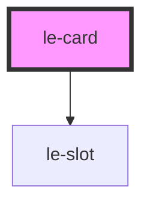

# le-card

<!-- Auto Generated Below -->

## Overview

A flexible card component with header, content, and footer slots.

The card adapts its appearance based on the current mode:
- `default`: Normal card display
- `admin`: Shows slot placeholders for CMS editing

## Properties

| Property      | Attribute     | Description                                 | Type                                    | Default     |
| ------------- | ------------- | ------------------------------------------- | --------------------------------------- | ----------- |
| `interactive` | `interactive` | Whether the card is interactive (clickable) | `boolean`                               | `false`     |
| `variant`     | `variant`     | Card variant style                          | `"default" \| "elevated" \| "outlined"` | `'default'` |

## Slots

| Slot       | Description                          |
| ---------- | ------------------------------------ |
|            | Default slot for main card content   |
| `"footer"` | Card footer content (buttons, links) |
| `"header"` | Card header content (title, actions) |

## Shadow Parts

| Part        | Description |
| ----------- | ----------- |
| `"card"`    |             |
| `"content"` |             |
| `"footer"`  |             |
| `"header"`  |             |

## Dependencies

### Depends on

- [le-slot](../le-slot)

### Graph

----------------------------------------------

*Built with [StencilJS](https://stenciljs.com/)*
