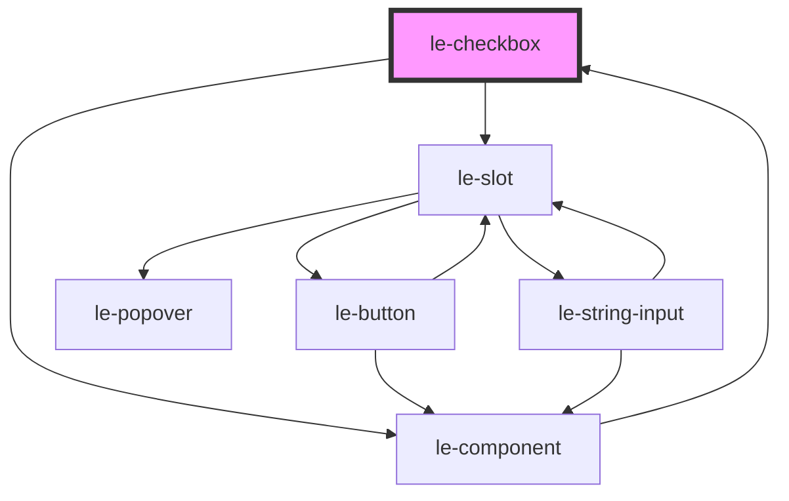

# le-checkbox

<!-- Auto Generated Below -->

## Overview

A checkbox component with support for labels, descriptions, and external IDs.

## Properties

| Property     | Attribute     | Description                                                                         | Type      | Default     |
| ------------ | ------------- | ----------------------------------------------------------------------------------- | --------- | ----------- |
| `checked`    | `checked`     | Whether the checkbox is checked                                                     | `boolean` | `false`     |
| `disabled`   | `disabled`    | Whether the checkbox is disabled                                                    | `boolean` | `false`     |
| `externalId` | `external-id` | External ID for linking with external systems (e.g. database ID, PDF form field ID) | `string`  | `undefined` |
| `name`       | `name`        | The name of the checkbox input                                                      | `string`  | `undefined` |
| `value`      | `value`       | The value of the checkbox input                                                     | `string`  | `undefined` |

## Events

| Event    | Description                            | Type                                                                                  |
| -------- | -------------------------------------- | ------------------------------------------------------------------------------------- |
| `change` | Emitted when the checked state changes | `CustomEvent<{ checked: boolean; value: string; name: string; externalId: string; }>` |

## Slots

| Slot            | Description                                           |
| --------------- | ----------------------------------------------------- |
|                 | The label text for the checkbox                       |
| `"description"` | Additional description text displayed below the label |

## Dependencies

### Used by

 - [le-component](../le-component)

### Depends on

- [le-component](../le-component)
- [le-slot](../le-slot)

### Graph

----------------------------------------------

*Built with [StencilJS](https://stenciljs.com/)*
