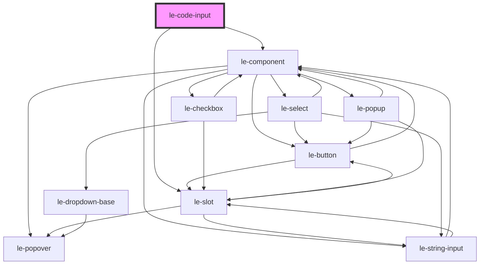

# le-code-input

<!-- Auto Generated Below -->

## Overview

A one-time code input component with individual frames for each character.
Supports standard copy/paste and range selection behaviors.

## Properties

| Property      | Attribute     | Description                                                                                                            | Type                 | Default     |
| ------------- | ------------- | ---------------------------------------------------------------------------------------------------------------------- | -------------------- | ----------- |
| `description` | `description` | Description text displayed below the input in case there is a more complex markup, it can be provided via slot as well | `string`             | `undefined` |
| `disabled`    | `disabled`    | Whether the input is disabled                                                                                          | `boolean`            | `false`     |
| `error`       | `error`       | Internal validation state (can be set externally manually or via simple check)                                         | `boolean`            | `false`     |
| `externalId`  | `external-id` | External ID for linking with external systems                                                                          | `string`             | `undefined` |
| `label`       | `label`       | Label for the input                                                                                                    | `string`             | `undefined` |
| `length`      | `length`      | Length of the code (number of characters)                                                                              | `number`             | `6`         |
| `name`        | `name`        | The name of the input                                                                                                  | `string`             | `undefined` |
| `readonly`    | `readonly`    | Whether the input is read-only                                                                                         | `boolean`            | `false`     |
| `type`        | `type`        | The type of code (numeric or alphanumeric) This affects the keyboard layout on mobile devices.                         | `"number" \| "text"` | `'text'`    |
| `value`       | `value`       | The value of the input                                                                                                 | `string`             | `''`        |

## Events

| Event      | Description                                         | Type                                                                |
| ---------- | --------------------------------------------------- | ------------------------------------------------------------------- |
| `leBlur`   | Emitted when the input is blurred                   | `CustomEvent<void>`                                                 |
| `leChange` | Emitted when the value changes (on blur or Enter)   | `CustomEvent<{ value: string; name: string; externalId: string; }>` |
| `leFocus`  | Emitted when the input is focused                   | `CustomEvent<void>`                                                 |
| `leInput`  | Emitted when the input value changes (on keystroke) | `CustomEvent<{ value: string; name: string; externalId: string; }>` |

## Slots

| Slot            | Description                                           |
| --------------- | ----------------------------------------------------- |
| `"description"` | Additional description text displayed below the input |

## Dependencies

### Depends on

- [le-component](../le-component)
- [le-slot](../le-slot)

### Graph

----------------------------------------------

*Built with [StencilJS](https://stenciljs.com/)*
