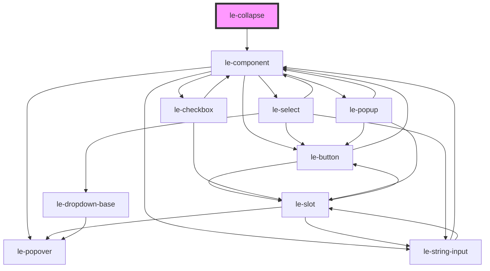

# le-collapse

<!-- Auto Generated Below -->

## Overview

Animated show/hide wrapper.

Supports height collapse (auto->0) and/or fading.
Can optionally listen to the nearest `le-header` shrink events.

## Properties

| Property                 | Attribute                   | Description                                                        | Type      | Default |
| ------------------------ | --------------------------- | ------------------------------------------------------------------ | --------- | ------- |
| `collapseOnHeaderShrink` | `collapse-on-header-shrink` | If true, collapse/expand based on the nearest header shrink event. | `boolean` | `false` |
| `noFading`               | `no-fading`                 | Stop fading the content when collapsing/expanding.                 | `boolean` | `false` |
| `open`                   | `open`                      | Whether the content should be shown.                               | `boolean` | `true`  |
| `scrollDown`             | `scroll-down`               | Whether the content should scroll down from the top when open.     | `boolean` | `false` |

## Slots

| Slot | Description        |
| ---- | ------------------ |
|      | Content to animate |

## Shadow Parts

| Part       | Description |
| ---------- | ----------- |
| `"region"` |             |

## Dependencies

### Depends on

- [le-component](../le-component)

### Graph

----------------------------------------------

*Built with [StencilJS](https://stenciljs.com/)*
