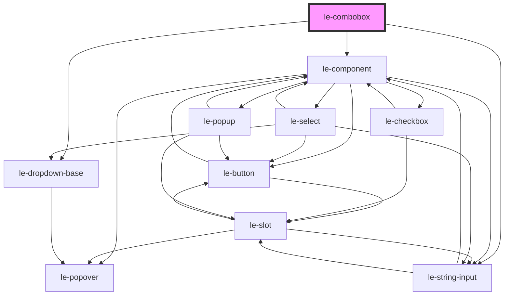

# le-combobox

<!-- Auto Generated Below -->

## Overview

A combobox component with searchable dropdown.

Combines a text input with a dropdown list, allowing users to
filter options by typing or select from the list.

## Properties

| Property          | Attribute           | Description                                                      | Type                             | Default               |
| ----------------- | ------------------- | ---------------------------------------------------------------- | -------------------------------- | --------------------- |
| `allowCustom`     | `allow-custom`      | Whether to allow custom values not in the options list.          | `boolean`                        | `false`               |
| `disabled`        | `disabled`          | Whether the combobox is disabled.                                | `boolean`                        | `false`               |
| `emptyText`       | `empty-text`        | Text to show when no options match the search.                   | `string`                         | `'No results found'`  |
| `fullWidth`       | `full-width`        | Whether the multiselect should take full width of its container. | `boolean`                        | `false`               |
| `minSearchLength` | `min-search-length` | Minimum characters before showing filtered results.              | `number`                         | `0`                   |
| `name`            | `name`              | Name attribute for form submission.                              | `string`                         | `undefined`           |
| `open`            | `open`              | Whether the dropdown is currently open.                          | `boolean`                        | `false`               |
| `options`         | `options`           | The options to display in the dropdown.                          | `LeOption[] \| string`           | `[]`                  |
| `placeholder`     | `placeholder`       | Placeholder text for the input.                                  | `string`                         | `'Type to search...'` |
| `required`        | `required`          | Whether selection is required.                                   | `boolean`                        | `false`               |
| `size`            | `size`              | Size variant of the combobox.                                    | `"large" \| "medium" \| "small"` | `'medium'`            |
| `value`           | `value`             | The currently selected value.                                    | `number \| string`               | `undefined`           |

## Events

| Event      | Description                                               | Type                                |
| ---------- | --------------------------------------------------------- | ----------------------------------- |
| `leChange` | Emitted when the selected value changes.                  | `CustomEvent<LeOptionSelectDetail>` |
| `leClose`  | Emitted when the dropdown closes.                         | `CustomEvent<void>`                 |
| `leInput`  | Emitted when the input value changes (for custom values). | `CustomEvent<{ value: string; }>`   |
| `leOpen`   | Emitted when the dropdown opens.                          | `CustomEvent<void>`                 |

## Methods

### `focusInput() => Promise<void>`

Focuses the input element.

#### Returns

Type: `Promise<void>`

### `hideDropdown() => Promise<void>`

Closes the dropdown.

#### Returns

Type: `Promise<void>`

### `showDropdown() => Promise<void>`

Opens the dropdown.

#### Returns

Type: `Promise<void>`

## Dependencies

### Depends on

- [le-component](../le-component)
- [le-dropdown-base](../le-dropdown-base)
- [le-string-input](../le-string-input)

### Graph

----------------------------------------------

*Built with [StencilJS](https://stenciljs.com/)*
