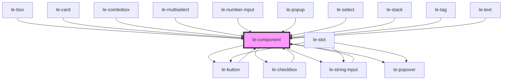

# le-component


<!-- Auto Generated Below -->


## Overview

Component wrapper for admin mode editing.

This component is used internally by other components to provide admin-mode
editing capabilities. It wraps the component's rendered output and shows
a settings popover for editing properties.

In default mode, it acts as a simple passthrough (display: contents).
In admin mode, it shows a border, component name header, and settings popover.

The host element is found automatically by traversing up through the shadow DOM.

Usage inside a component's render method:
```tsx
render() {
  return (
    <le-component component="le-card">
      <Host>...</Host>
    </le-component>
  );
}
```

## Properties

| Property                 | Attribute      | Description                                                                                                          | Type                         | Default     |
| ------------------------ | -------------- | -------------------------------------------------------------------------------------------------------------------- | ---------------------------- | ----------- |
| `component` _(required)_ | `component`    | The tag name of the component (e.g., 'le-card'). Used to look up property metadata and display the component name.   | `string`                     | `undefined` |
| `displayName`            | `display-name` | Optional display name for the component. If not provided, the tag name will be formatted as the display name.        | `string`                     | `undefined` |
| `hostClass`              | `host-class`   | Classes to apply to the host element. Allows parent components to pass their styling classes.                        | `string`                     | `undefined` |
| `hostStyle`              | --             | Inline styles to apply to the host element. Allows parent components to pass dynamic styles (e.g., flex properties). | `{ [key: string]: string; }` | `undefined` |


## Slots

| Slot | Description                      |
| ---- | -------------------------------- |
|      | The component's rendered content |


## Dependencies

### Used by

 - [le-box](../le-box)
 - [le-button](../le-button)
 - [le-card](../le-card)
 - [le-checkbox](../le-checkbox)
 - [le-combobox](../le-combobox)
 - [le-multiselect](../le-multiselect)
 - [le-number-input](../le-number-input)
 - [le-popup](../le-popup)
 - [le-select](../le-select)
 - [le-stack](../le-stack)
 - [le-string-input](../le-string-input)
 - [le-tag](../le-tag)
 - [le-text](../le-text)

### Depends on

- [le-button](../le-button)
- [le-checkbox](../le-checkbox)
- [le-string-input](../le-string-input)
- [le-popover](../le-popover)

### Graph


----------------------------------------------

*Built with [StencilJS](https://stenciljs.com/)*
