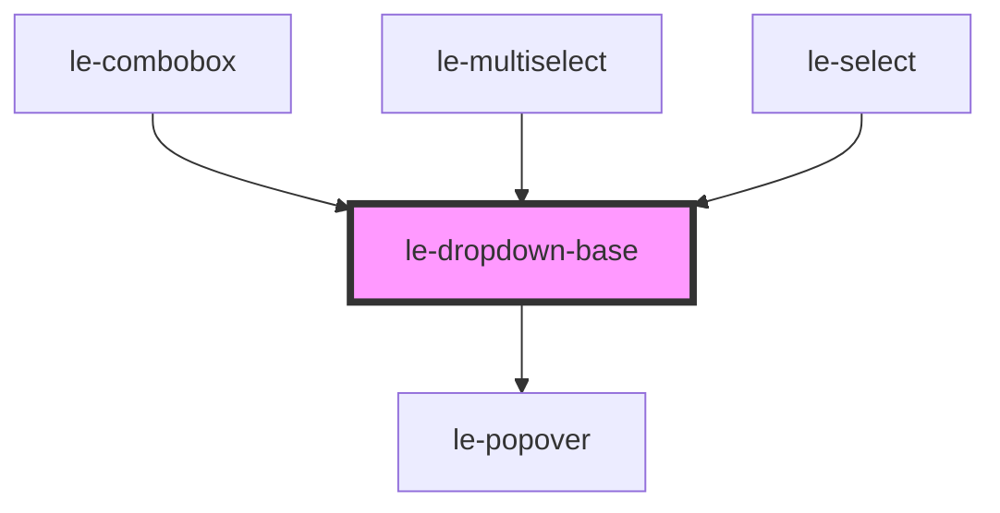

# le-dropdown-base

<!-- Auto Generated Below -->

## Overview

Internal dropdown base component that provides shared functionality
for select, combobox, and multiselect components.

Wraps le-popover for positioning and provides:
- Option list rendering with groups
- Keyboard navigation (↑↓, Enter, Escape, Home/End)
- Option filtering support
- Single and multi-select modes

## Properties

| Property              | Attribute                | Description                                                                                      | Type                                           | Default        |
| --------------------- | ------------------------ | ------------------------------------------------------------------------------------------------ | ---------------------------------------------- | -------------- |
| `closeOnClickOutside` | `close-on-click-outside` | Whether to close the dropdown when clicking outside. (used to support combobox with input focus) | `boolean`                                      | `true`         |
| `disabled`            | `disabled`               | Whether the dropdown is disabled.                                                                | `boolean`                                      | `false`        |
| `emptyText`           | `empty-text`             | Placeholder text when no options match filter.                                                   | `string`                                       | `'No options'` |
| `filterFn`            | --                       | Filter function for options. Return true to include the option.                                  | `(option: LeOption, query: string) => boolean` | `undefined`    |
| `filterQuery`         | `filter-query`           | Current filter query string.                                                                     | `string`                                       | `''`           |
| `fullWidth`           | `full-width`             | Sets the dropdown to full width of the trigger.                                                  | `boolean`                                      | `false`        |
| `maxHeight`           | `max-height`             | Maximum height of the dropdown list.                                                             | `string`                                       | `'300px'`      |
| `multiple`            | `multiple`               | Whether multiple selection is allowed.                                                           | `boolean`                                      | `false`        |
| `open`                | `open`                   | Whether the dropdown is open.                                                                    | `boolean`                                      | `false`        |
| `options`             | --                       | The options to display in the dropdown.                                                          | `LeOption[]`                                   | `[]`           |
| `showCheckboxes`      | `show-checkboxes`        | Whether to show checkboxes for multiselect mode.                                                 | `boolean`                                      | `true`         |
| `value`               | `value`                  | Current value(s) - single value or array for multiselect.                                        | `LeOptionValue[] \| number \| string`          | `undefined`    |
| `width`               | `width`                  | Width of the dropdown. If not set, matches trigger width.                                        | `string`                                       | `undefined`    |

## Events

| Event             | Description                         | Type                                |
| ----------------- | ----------------------------------- | ----------------------------------- |
| `leDropdownClose` | Emitted when the dropdown closes.   | `CustomEvent<void>`                 |
| `leDropdownOpen`  | Emitted when the dropdown opens.    | `CustomEvent<void>`                 |
| `leOptionSelect`  | Emitted when an option is selected. | `CustomEvent<LeOptionSelectDetail>` |

## Methods

### `hide() => Promise<void>`

Closes the dropdown.

#### Returns

Type: `Promise<void>`

### `show() => Promise<void>`

Opens the dropdown.

#### Returns

Type: `Promise<void>`

### `toggle() => Promise<void>`

Toggles the dropdown.

#### Returns

Type: `Promise<void>`

## Slots

| Slot        | Description                            |
| ----------- | -------------------------------------- |
| `"trigger"` | The element that triggers the dropdown |

## Dependencies

### Used by

 - [le-combobox](../le-combobox)
 - [le-multiselect](../le-multiselect)
 - [le-select](../le-select)

### Depends on

- [le-popover](../le-popover)

### Graph

----------------------------------------------

*Built with [StencilJS](https://stenciljs.com/)*
