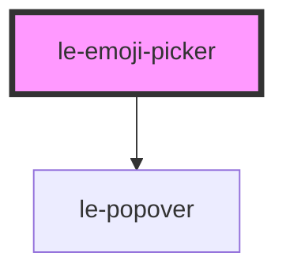

# le-emoji-picker

<!-- Auto Generated Below -->

## Overview

Emoji picker for selecting an emoji icon.

Uses le-popover for the dropdown layer.

## Properties

| Property            | Attribute            | Description                            | Type      | Default            |
| ------------------- | -------------------- | -------------------------------------- | --------- | ------------------ |
| `open`              | `open`               | Whether the picker popover is open.    | `boolean` | `false`            |
| `recentCount`       | `recent-count`       | How many recently used emojis to keep. | `number`  | `20`               |
| `searchPlaceholder` | `search-placeholder` | Placeholder for the search input.      | `string`  | `'Search emojis…'` |

## Events

| Event           | Description                        | Type                               |
| --------------- | ---------------------------------- | ---------------------------------- |
| `leEmojiSelect` | Emitted when an emoji is selected. | `CustomEvent<LeEmojiSelectDetail>` |

## Methods

### `hide() => Promise<void>`

#### Returns

Type: `Promise<void>`

### `show() => Promise<void>`

#### Returns

Type: `Promise<void>`

### `toggle() => Promise<void>`

#### Returns

Type: `Promise<void>`

## Slots

| Slot        | Description                |
| ----------- | -------------------------- |
| `"trigger"` | Trigger element (optional) |

## Dependencies

### Depends on

- [le-popover](../le-popover)

### Graph

----------------------------------------------

*Built with [StencilJS](https://stenciljs.com/)*
