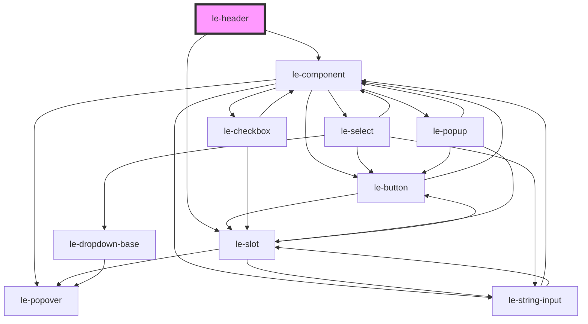

# le-web-page-header

<!-- Auto Generated Below -->

## Overview

A functional page header with scroll-aware behaviors.

Features:
- Static (default), sticky, or fixed positioning
- Optional shrink-on-scroll behavior via `shrink-offset`
- Optional reveal-on-scroll-up via `reveal-on-scroll` (sticky only)

Slots:
- `start`: left side (logo/back button)
- `title`: centered/primary title content
- `end`: right side actions
- default: extra content row (e.g., tabs/search) rendered below main row

## Properties

| Property         | Attribute          | Description                                                                                                                                                                                                                                                                                   | Type      | Default     |
| ---------------- | ------------------ | --------------------------------------------------------------------------------------------------------------------------------------------------------------------------------------------------------------------------------------------------------------------------------------------- | --------- | ----------- |
| `expandOnHover`  | `expand-on-hover`  | If true, expand the header when hovered                                                                                                                                                                                                                                                       | `boolean` | `false`     |
| `fixed`          | `fixed`            | Fixed positioning (out-of-flow). Takes precedence over `sticky`/`static`.                                                                                                                                                                                                                     | `boolean` | `false`     |
| `isStatic`       | `static`           | Force static positioning (default). Ignored if `sticky` or `fixed` are true.                                                                                                                                                                                                                  | `boolean` | `false`     |
| `revealOnScroll` | `reveal-on-scroll` | Sticky-only reveal behavior (hide on scroll down, show on scroll up). - missing/false: disabled - true/empty attribute: enabled with default threshold (16) - number (as string): enabled and used as threshold                                                                               | `string`  | `undefined` |
| `shrinkOffset`   | `shrink-offset`    | Shrink trigger. - missing/0: disabled - number (px): shrink when scrollY >= that value (but never before header height) - css var name (e.g. --foo): shrink when scrollY >= resolved var value - selector (e.g. .page-title): shrink when that element scrolls out of view above the viewport | `string`  | `undefined` |
| `sticky`         | `sticky`           | Sticky positioning (in-flow). Ignored if `fixed` is true.                                                                                                                                                                                                                                     | `boolean` | `false`     |

## Events

| Event                      | Description                                             | Type                                                                                         |
| -------------------------- | ------------------------------------------------------- | -------------------------------------------------------------------------------------------- |
| `leHeaderShrinkChange`     | Emits when the header shrinks/expands (only on change). | `CustomEvent<{ shrunk: boolean; y: number; }>`                                               |
| `leHeaderState`            | Emits whenever scroll-driven state changes.             | `CustomEvent<{ y: number; direction: "up" \| "down"; revealed: boolean; shrunk: boolean; }>` |
| `leHeaderVisibilityChange` | Emits when the header hides/shows (only on change).     | `CustomEvent<{ visible: boolean; y: number; }>`                                              |

## Slots

| Slot      | Description                    |
| --------- | ------------------------------ |
|           | Optional secondary row content |
| `"end"`   | End area content               |
| `"start"` | Start area content             |
| `"title"` | Title content                  |

## Shadow Parts

| Part          | Description |
| ------------- | ----------- |
| `"end"`       |             |
| `"header"`    |             |
| `"inner"`     |             |
| `"row"`       |             |
| `"secondary"` |             |
| `"start"`     |             |
| `"title"`     |             |

## Dependencies

### Depends on

- [le-component](../le-component)
- [le-slot](../le-slot)

### Graph

----------------------------------------------

*Built with [StencilJS](https://stenciljs.com/)*
