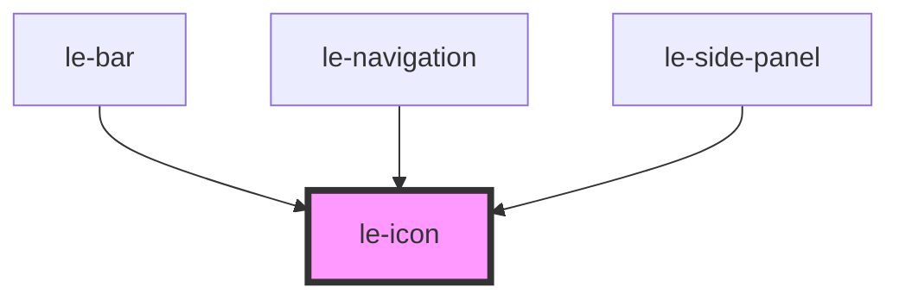

# le-icon

<!-- Auto Generated Below -->

## Properties

| Property | Attribute | Description                                                                                                                           | Type     | Default |
| -------- | --------- | ------------------------------------------------------------------------------------------------------------------------------------- | -------- | ------- |
| `name`   | `name`    | Name of the icon to display. Corresponds to a JSON file in the assets folder. For example, "search" will load the "search.json" file. | `string` | `null`  |
| `size`   | `size`    | Size of the icon in pixels. Default is 16.                                                                                            | `number` | `16`    |

## Dependencies

### Used by

 - [le-bar](../le-bar)
 - [le-navigation](../le-navigation)
 - [le-side-panel](../le-side-panel)

### Graph

----------------------------------------------

*Built with [StencilJS](https://stenciljs.com/)*
