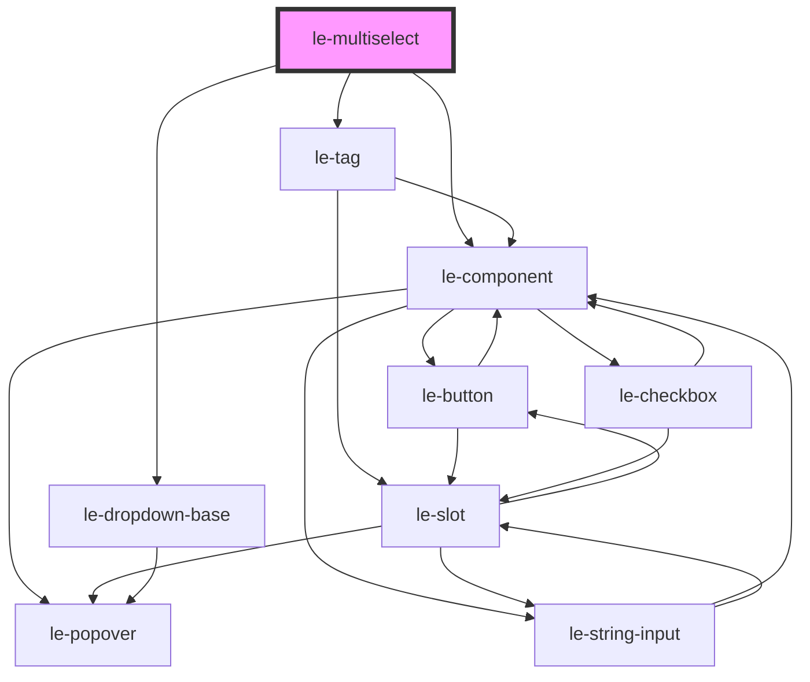

# le-multiselect

<!-- Auto Generated Below -->

## Overview

A multiselect component for selecting multiple options.

Displays selected items as tags with optional search filtering.

## Properties

| Property        | Attribute         | Description                                                      | Type                             | Default               |
| --------------- | ----------------- | ---------------------------------------------------------------- | -------------------------------- | --------------------- |
| `disabled`      | `disabled`        | Whether the multiselect is disabled.                             | `boolean`                        | `false`               |
| `emptyText`     | `empty-text`      | Text to show when no options match the search.                   | `string`                         | `'No results found'`  |
| `fullWidth`     | `full-width`      | Whether the multiselect should take full width of its container. | `boolean`                        | `false`               |
| `maxSelections` | `max-selections`  | Maximum number of selections allowed.                            | `number`                         | `undefined`           |
| `name`          | `name`            | Name attribute for form submission.                              | `string`                         | `undefined`           |
| `open`          | `open`            | Whether the dropdown is currently open.                          | `boolean`                        | `false`               |
| `options`       | `options`         | The options to display in the dropdown.                          | `LeOption[] \| string`           | `[]`                  |
| `placeholder`   | `placeholder`     | Placeholder text when no options are selected.                   | `string`                         | `'Select options...'` |
| `required`      | `required`        | Whether selection is required.                                   | `boolean`                        | `false`               |
| `searchable`    | `searchable`      | Whether the input is searchable.                                 | `boolean`                        | `false`               |
| `showSelectAll` | `show-select-all` | Whether to show a "Select All" option.                           | `boolean`                        | `false`               |
| `size`          | `size`            | Size variant of the multiselect.                                 | `"large" \| "medium" \| "small"` | `'medium'`            |
| `value`         | --                | The currently selected values.                                   | `LeOptionValue[]`                | `[]`                  |

## Events

| Event      | Description                              | Type                                     |
| ---------- | ---------------------------------------- | ---------------------------------------- |
| `leChange` | Emitted when the selected values change. | `CustomEvent<LeMultiOptionSelectDetail>` |
| `leClose`  | Emitted when the dropdown closes.        | `CustomEvent<void>`                      |
| `leOpen`   | Emitted when the dropdown opens.         | `CustomEvent<void>`                      |

## Methods

### `clearSelection() => Promise<void>`

Clears all selections.

#### Returns

Type: `Promise<void>`

### `hideDropdown() => Promise<void>`

Closes the dropdown.

#### Returns

Type: `Promise<void>`

### `showDropdown() => Promise<void>`

Opens the dropdown.

#### Returns

Type: `Promise<void>`

## Dependencies

### Depends on

- [le-tag](../le-tag)
- [le-component](../le-component)
- [le-dropdown-base](../le-dropdown-base)

### Graph

----------------------------------------------

*Built with [StencilJS](https://stenciljs.com/)*
