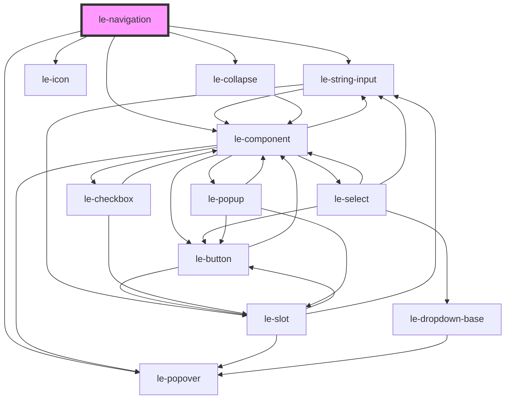

# le-navigation

<!-- Auto Generated Below -->

## Overview

Navigation component with vertical (tree) and horizontal (menu) layouts.

- Accepts items as `LeOption[]` or a JSON string.
- Supports hierarchical items via `children`.
- Supports persisted expansion via `open` on items.

## Properties

| Property                 | Attribute                    | Description                                                                                                                                                        | Type                         | Default              |
| ------------------------ | ---------------------------- | ------------------------------------------------------------------------------------------------------------------------------------------------------------------ | ---------------------------- | -------------------- |
| `activeUrl`              | `active-url`                 | Active url for automatic selection.                                                                                                                                | `string`                     | `''`                 |
| `emptyText`              | `empty-text`                 | Text shown when no items match the filter.                                                                                                                         | `string`                     | `'No results found'` |
| `hamburgerAlign`         | `hamburger-align`            | Alignment of the hamburger trigger within the row.                                                                                                                 | `"end" \| "start"`           | `'start'`            |
| `items`                  | `items`                      | Navigation items. Can be passed as an array or JSON string (same pattern as le-select).                                                                            | `LeOption[] \| string`       | `[]`                 |
| `minVisibleItemsForMore` | `min-visible-items-for-more` | Minimum number of visible top-level items required to use the "More" overflow. If fewer would be visible, the navigation falls back to hamburger.                  | `number`                     | `2`                  |
| `orientation`            | `orientation`                | Layout orientation.                                                                                                                                                | `"horizontal" \| "vertical"` | `'horizontal'`       |
| `overflowMode`           | `overflow-mode`              | Overflow behavior for horizontal, non-wrapping menus. - more: moves overflow items into a "More" popover - hamburger: turns the whole nav into a hamburger popover | `"hamburger" \| "more"`      | `'more'`             |
| `searchPlaceholder`      | `search-placeholder`         | Placeholder text for the search input.                                                                                                                             | `string`                     | `'Search...'`        |
| `searchable`             | `searchable`                 | Enables a search input for the vertical navigation.                                                                                                                | `boolean`                    | `false`              |
| `submenuSearchable`      | `submenu-searchable`         | Whether submenu popovers should include a filter input.                                                                                                            | `boolean`                    | `false`              |
| `wrap`                   | `wrap`                       | Horizontal wrapping behavior. If false, overflow behavior depends on `overflowMode`.                                                                               | `boolean`                    | `true`               |

## Events

| Event             | Description                                                                                                                                                             | Type                                        |
| ----------------- | ----------------------------------------------------------------------------------------------------------------------------------------------------------------------- | ------------------------------------------- |
| `leNavItemSelect` | Fired when a navigation item is activated.  This event is cancelable. Call `event.preventDefault()` to prevent default browser navigation and implement custom routing. | `CustomEvent<LeNavigationItemSelectDetail>` |
| `leNavItemToggle` | Fired when a tree branch is toggled.                                                                                                                                    | `CustomEvent<LeNavigationItemToggleDetail>` |

## Slots

| Slot                  | Description                                      |
| --------------------- | ------------------------------------------------ |
| `"hamburger-trigger"` | Custom trigger contents for the hamburger button |
| `"more-trigger"`      | Custom trigger contents for the "More" button    |

## Shadow Parts

| Part                  | Description |
| --------------------- | ----------- |
| `"hamburger-trigger"` |             |
| `"more-trigger"`      |             |

## Dependencies

### Depends on

- [le-string-input](../le-string-input)
- [le-icon](../le-icon)
- [le-collapse](../le-collapse)
- [le-popover](../le-popover)
- [le-component](../le-component)

### Graph

----------------------------------------------

*Built with [StencilJS](https://stenciljs.com/)*
