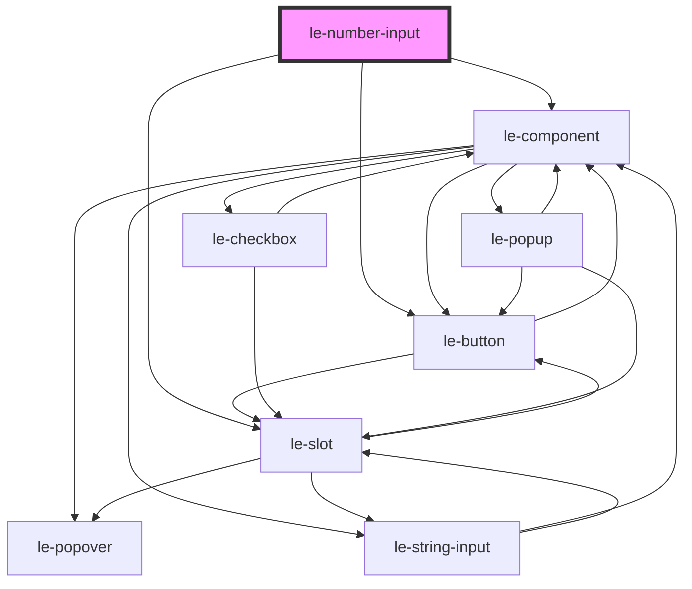

# le-number-input

<!-- Auto Generated Below -->

## Overview

A number input component with validation, keyboard controls, and custom spinners.

## Properties

| Property       | Attribute       | Description                                   | Type      | Default     |
| -------------- | --------------- | --------------------------------------------- | --------- | ----------- |
| `disabled`     | `disabled`      | Whether the input is disabled                 | `boolean` | `false`     |
| `externalId`   | `external-id`   | External ID for linking with external systems | `string`  | `undefined` |
| `iconStart`    | `icon-start`    | Icon for the start icon                       | `string`  | `undefined` |
| `label`        | `label`         | Label for the input                           | `string`  | `undefined` |
| `max`          | `max`           | Maximum allowed value                         | `number`  | `undefined` |
| `min`          | `min`           | Minimum allowed value                         | `number`  | `undefined` |
| `name`         | `name`          | The name of the input                         | `string`  | `undefined` |
| `placeholder`  | `placeholder`   | Placeholder text                              | `string`  | `undefined` |
| `readonly`     | `readonly`      | Whether the input is read-only                | `boolean` | `false`     |
| `required`     | `required`      | Whether the input is required                 | `boolean` | `false`     |
| `showSpinners` | `show-spinners` | Whether to show the spinner controls          | `boolean` | `true`      |
| `step`         | `step`          | Step value for increment/decrement            | `number`  | `1`         |
| `value`        | `value`         | The value of the input                        | `number`  | `undefined` |

## Events

| Event      | Description                                              | Type                                                                                  |
| ---------- | -------------------------------------------------------- | ------------------------------------------------------------------------------------- |
| `leChange` | Emitted when the value changes (on blur or Enter)        | `CustomEvent<{ value: number; name: string; externalId: string; isValid: boolean; }>` |
| `leInput`  | Emitted when the input value changes (on keystroke/spin) | `CustomEvent<{ value: number; name: string; externalId: string; isValid: boolean; }>` |

## Slots

| Slot            | Description                                           |
| --------------- | ----------------------------------------------------- |
|                 | The label text for the input                          |
| `"description"` | Additional description text displayed below the input |
| `"icon-start"`  | Icon to display at the start of the input             |

## Dependencies

### Depends on

- [le-component](../le-component)
- [le-button](../le-button)
- [le-slot](../le-slot)

### Graph

----------------------------------------------

*Built with [StencilJS](https://stenciljs.com/)*
