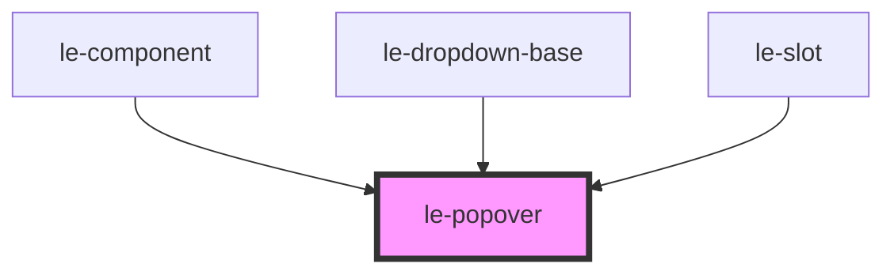

# le-popover

<!-- Auto Generated Below -->

## Overview

A popover component for displaying floating content.

Uses the native HTML Popover API for proper layering with dialogs
and other top-layer elements. Falls back gracefully in older browsers.

## Properties

| Property              | Attribute                | Description                                                   | Type                                               | Default     |
| --------------------- | ------------------------ | ------------------------------------------------------------- | -------------------------------------------------- | ----------- |
| `align`               | `align`                  | Alignment of the popover                                      | `"center" \| "end" \| "start"`                     | `'start'`   |
| `closeOnClickOutside` | `close-on-click-outside` | Whether clicking outside closes the popover                   | `boolean`                                          | `true`      |
| `closeOnEscape`       | `close-on-escape`        | Whether pressing Escape closes the popover                    | `boolean`                                          | `true`      |
| `maxWidth`            | `max-width`              | Maximum width for the popover (e.g., '400px', '25rem')        | `string`                                           | `undefined` |
| `minWidth`            | `min-width`              | Minimum width for the popover (e.g., '200px', '15rem')        | `string`                                           | `'200px'`   |
| `mode`                | `mode`                   | Mode of the popover should be 'default' for internal use      | `"admin" \| "default"`                             | `undefined` |
| `offset`              | `offset`                 | Offset from the trigger element (in pixels)                   | `number`                                           | `8`         |
| `open`                | `open`                   | Whether the popover is currently open                         | `boolean`                                          | `false`     |
| `popoverTitle`        | `popover-title`          | Optional title for the popover header                         | `string`                                           | `undefined` |
| `position`            | `position`               | Position of the popover relative to its trigger               | `"auto" \| "bottom" \| "left" \| "right" \| "top"` | `'bottom'`  |
| `showClose`           | `show-close`             | Whether to show a close button in the header                  | `boolean`                                          | `true`      |
| `triggerFullWidth`    | `trigger-full-width`     | Should the popover's trigger take full width of its container | `boolean`                                          | `false`     |
| `width`               | `width`                  | Fixed width for the popover (e.g., '300px', '20rem')          | `string`                                           | `undefined` |

## Events

| Event            | Description                     | Type                |
| ---------------- | ------------------------------- | ------------------- |
| `lePopoverClose` | Emitted when the popover closes | `CustomEvent<void>` |
| `lePopoverOpen`  | Emitted when the popover opens  | `CustomEvent<void>` |

## Methods

### `hide() => Promise<void>`

Closes the popover

#### Returns

Type: `Promise<void>`

### `show() => Promise<void>`

Opens the popover

#### Returns

Type: `Promise<void>`

### `toggle() => Promise<void>`

Toggles the popover

#### Returns

Type: `Promise<void>`

## Slots

| Slot        | Description                                  |
| ----------- | -------------------------------------------- |
|             | Content to display inside the popover        |
| `"trigger"` | Element that triggers the popover (optional) |

## Shadow Parts

| Part        | Description |
| ----------- | ----------- |
| `"content"` |             |
| `"trigger"` |             |

## Dependencies

### Used by

 - [le-component](../le-component)
 - [le-dropdown-base](../le-dropdown-base)
 - [le-slot](../le-slot)

### Graph

----------------------------------------------

*Built with [StencilJS](https://stenciljs.com/)*
