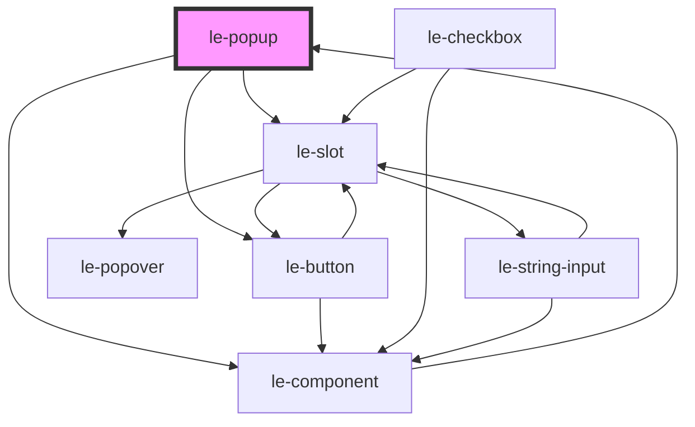

# le-popup

<!-- Auto Generated Below -->

## Overview

A flexible popup/dialog component for alerts, confirms, prompts, and custom content.

Uses the native HTML <dialog> element for proper modal behavior, accessibility,
and focus management. Can be used declaratively in HTML or programmatically
via leAlert(), leConfirm(), lePrompt().

## Properties

| Property          | Attribute           | Description                                                                             | Type                                                                                            | Default     |
| ----------------- | ------------------- | --------------------------------------------------------------------------------------- | ----------------------------------------------------------------------------------------------- | ----------- |
| `cancelText`      | `cancel-text`       | Text for the cancel button                                                              | `string`                                                                                        | `'Cancel'`  |
| `closeOnBackdrop` | `close-on-backdrop` | Whether clicking the backdrop closes the popup (modal only)                             | `boolean`                                                                                       | `true`      |
| `confirmText`     | `confirm-text`      | Text for the confirm/OK button                                                          | `string`                                                                                        | `'OK'`      |
| `defaultValue`    | `default-value`     | Default value for prompt input                                                          | `string`                                                                                        | `''`        |
| `message`         | `message`           | Message text to display (for alert/confirm/prompt types)                                | `string`                                                                                        | `undefined` |
| `modal`           | `modal`             | Whether the popup is modal (blocks interaction with page behind)                        | `boolean`                                                                                       | `true`      |
| `mode`            | `mode`              | The mode of the Le Kit (e.g., 'default' or 'admin')                                     | `string`                                                                                        | `'default'` |
| `open`            | `open`              | Whether the popup is currently visible                                                  | `boolean`                                                                                       | `false`     |
| `placeholder`     | `placeholder`       | Placeholder text for prompt input                                                       | `string`                                                                                        | `''`        |
| `popupTitle`      | `popup-title`       | Optional title for the popup header                                                     | `string`                                                                                        | `undefined` |
| `position`        | `position`          | Position of the popup on screen                                                         | `"bottom" \| "bottom-left" \| "bottom-right" \| "center" \| "top" \| "top-left" \| "top-right"` | `'center'`  |
| `type`            | `type`              | Type of popup: alert (OK only), confirm (OK/Cancel), prompt (input + OK/Cancel), custom | `"alert" \| "confirm" \| "custom" \| "prompt"`                                                  | `'alert'`   |

## Events

| Event       | Description                                                       | Type                       |
| ----------- | ----------------------------------------------------------------- | -------------------------- |
| `leCancel`  | Emitted when the popup is cancelled (Cancel clicked or dismissed) | `CustomEvent<PopupResult>` |
| `leClose`   | Emitted when the popup closes                                     | `CustomEvent<PopupResult>` |
| `leConfirm` | Emitted when the popup is confirmed (OK clicked)                  | `CustomEvent<PopupResult>` |
| `leOpen`    | Emitted when the popup opens                                      | `CustomEvent<void>`        |

## Methods

### `hide(confirmed?: boolean) => Promise<void>`

Closes the popup with a result

#### Parameters

| Name        | Type      | Description |
| ----------- | --------- | ----------- |
| `confirmed` | `boolean` |             |

#### Returns

Type: `Promise<void>`

### `show() => Promise<PopupResult>`

Opens the popup and returns a promise that resolves when closed

#### Returns

Type: `Promise<PopupResult>`

## Slots

| Slot       | Description                                      |
| ---------- | ------------------------------------------------ |
|            | Default slot for custom body content             |
| `"footer"` | Custom footer content (replaces default buttons) |
| `"header"` | Custom header content (replaces title)           |

## Shadow Parts

| Part               | Description |
| ------------------ | ----------- |
| `"body"`           |             |
| `"button-cancel"`  |             |
| `"button-confirm"` |             |
| `"container"`      |             |
| `"dialog"`         |             |
| `"footer"`         |             |
| `"header"`         |             |
| `"input"`          |             |

## Dependencies

### Used by

 - [le-component](../le-component)

### Depends on

- [le-slot](../le-slot)
- [le-button](../le-button)
- [le-component](../le-component)

### Graph

----------------------------------------------

*Built with [StencilJS](https://stenciljs.com/)*
