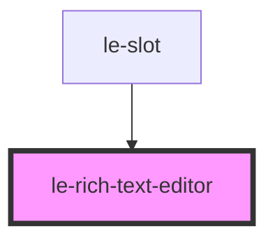

# le-rich-text-editor

<!-- Auto Generated Below -->

## Overview

A rich text editor with block-level editing and Notion-style "/" commands.

Features:
- Block-level editing (paragraphs, headings, quotes, code)
- Notion-style "/" command menu for changing block types
- Enter creates new paragraphs
- Inline formatting (bold, italic, underline, strikethrough, links)
- Automatic text node wrapping in paragraphs

## Properties

| Property      | Attribute      | Description | Type                                 | Default                      |
| ------------- | -------------- | ----------- | ------------------------------------ | ---------------------------- |
| `autofocus`   | `autofocus`    |             | `boolean`                            | `false`                      |
| `disabled`    | `disabled`     |             | `boolean`                            | `false`                      |
| `editorId`    | `editor-id`    |             | `string`                             | `undefined`                  |
| `name`        | `name`         |             | `string`                             | `undefined`                  |
| `placeholder` | `placeholder`  |             | `string`                             | `'Type "/" for commands...'` |
| `readonly`    | `readonly`     |             | `boolean`                            | `false`                      |
| `required`    | `required`     |             | `boolean`                            | `false`                      |
| `showToolbar` | `show-toolbar` |             | `boolean`                            | `true`                       |
| `toolbarMode` | `toolbar-mode` |             | `"always" \| "focus" \| "selection"` | `'focus'`                    |
| `value`       | `value`        |             | `string`                             | `''`                         |
| `variant`     | `variant`      |             | `"full" \| "minimal" \| "standard"`  | `'full'`                     |

## Events

| Event      | Description | Type                                                   |
| ---------- | ----------- | ------------------------------------------------------ |
| `leBlur`   |             | `CustomEvent<void>`                                    |
| `leChange` |             | `CustomEvent<{ value: string; textContent: string; }>` |
| `leFocus`  |             | `CustomEvent<void>`                                    |
| `leInput`  |             | `CustomEvent<{ value: string; textContent: string; }>` |

## Slots

| Slot | Description                      |
| ---- | -------------------------------- |
|      | Default slot for initial content |

## Dependencies

### Used by

 - [le-slot](../le-slot)

### Graph

----------------------------------------------

*Built with [StencilJS](https://stenciljs.com/)*
