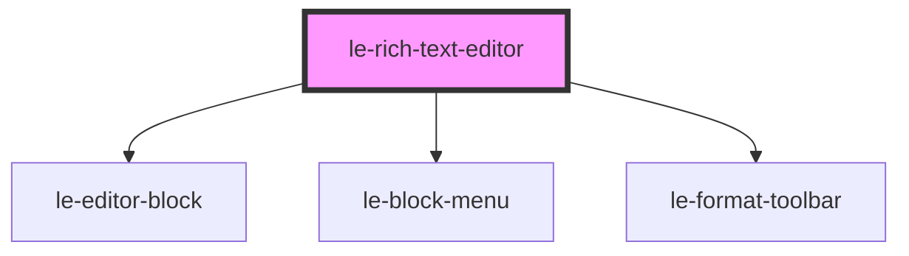

# le-rich-text-editor

<!-- Auto Generated Below -->

## Overview

Rich text editor with block-based editing, similar to Notion.

Features:
- Block-based content structure (paragraphs, headings, lists, quotes, code, dividers)
- Markdown shortcuts (# for headings, - for lists, > for quotes, etc.)
- Inline formatting toolbar (bold, italic, underline, strikethrough, code, links)
- Block command menu triggered by /
- Drag and drop block reordering
- HTML and Markdown export

## Properties

| Property      | Attribute     | Description                             | Type                | Default                      |
| ------------- | ------------- | --------------------------------------- | ------------------- | ---------------------------- |
| `autofocus`   | `autofocus`   | Whether to autofocus on mount.          | `boolean`           | `false`                      |
| `blockTypes`  | --            | Available block types.                  | `BlockTypeConfig[]` | `DEFAULT_BLOCK_CONFIGS`      |
| `maxHeight`   | `max-height`  | Maximum height (scrollable).            | `string`            | `undefined`                  |
| `minHeight`   | `min-height`  | Minimum height of the editor.           | `string`            | `undefined`                  |
| `placeholder` | `placeholder` | Placeholder text shown in empty editor. | `string`            | `"Type '/' for commands..."` |
| `readonly`    | `readonly`    | Whether the editor is in readonly mode. | `boolean`           | `false`                      |
| `value`       | `value`       | Initial HTML content.                   | `string`            | `undefined`                  |

## Events

| Event           | Description                      | Type                               |
| --------------- | -------------------------------- | ---------------------------------- |
| `leBlockAdd`    | Emitted when a block is added.   | `CustomEvent<LeBlock>`             |
| `leBlockRemove` | Emitted when a block is removed. | `CustomEvent<LeBlock>`             |
| `leBlur`        | Emitted when editor loses focus. | `CustomEvent<void>`                |
| `leChange`      | Emitted when content changes.    | `CustomEvent<LeBlockChangeDetail>` |
| `leFocus`       | Emitted when editor gains focus. | `CustomEvent<void>`                |

## Methods

### `blurEditor() => Promise<void>`

Blur the editor.

#### Returns

Type: `Promise<void>`

### `focusEditor() => Promise<void>`

Focus the editor.

#### Returns

Type: `Promise<void>`

### `getBlocks() => Promise<LeBlock[]>`

Get the raw block data.

#### Returns

Type: `Promise<LeBlock[]>`

### `getHtml() => Promise<string>`

Get the content as HTML.

#### Returns

Type: `Promise<string>`

### `getMarkdown() => Promise<string>`

Get the content as Markdown.

#### Returns

Type: `Promise<string>`

### `setHtml(html: string) => Promise<void>`

Set content from HTML.

#### Parameters

| Name   | Type     | Description |
| ------ | -------- | ----------- |
| `html` | `string` |             |

#### Returns

Type: `Promise<void>`

## Slots

| Slot | Description                                         |
| ---- | --------------------------------------------------- |
|      | Default slot (not used, content managed internally) |

## Dependencies

### Depends on

- [le-editor-block](.)
- [le-block-menu](.)
- [le-format-toolbar](.)

### Graph

----------------------------------------------

*Built with [StencilJS](https://stenciljs.com/)*
