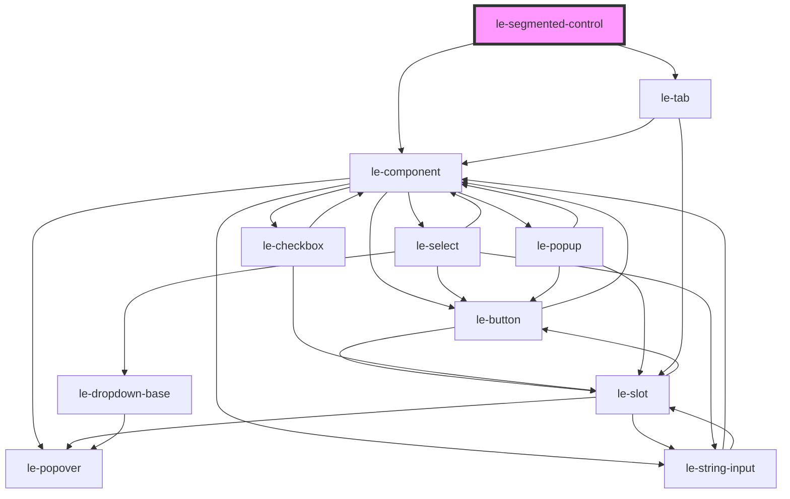

# le-segmented-control

<!-- Auto Generated Below -->

## Overview

A segmented control component (iOS-style toggle buttons).

Perfect for toggling between a small set of related options.

## Properties

| Property    | Attribute    | Description                                 | Type                                          | Default     |
| ----------- | ------------ | ------------------------------------------- | --------------------------------------------- | ----------- |
| `disabled`  | `disabled`   | Whether the control is disabled.            | `boolean`                                     | `false`     |
| `fullWidth` | `full-width` | Whether the control should take full width. | `boolean`                                     | `false`     |
| `options`   | --           | Array of options for the segmented control. | `LeOption[]`                                  | `[]`        |
| `overflow`  | `overflow`   | Scroll behavior for overflowing tabs.       | `"auto" \| "hidden" \| "scroll" \| "visible"` | `'auto'`    |
| `size`      | `size`       | Size of the control.                        | `"large" \| "medium" \| "small"`              | `'medium'`  |
| `value`     | `value`      | The value of the currently selected option. | `number \| string`                            | `undefined` |

## Events

| Event      | Description                         | Type                                |
| ---------- | ----------------------------------- | ----------------------------------- |
| `leChange` | Emitted when the selection changes. | `CustomEvent<LeOptionSelectDetail>` |

## Shadow Parts

| Part          | Description |
| ------------- | ----------- |
| `"container"` |             |

## Dependencies

### Depends on

- [le-component](../le-component)
- [le-tab](../le-tab)

### Graph

----------------------------------------------

*Built with [StencilJS](https://stenciljs.com/)*
