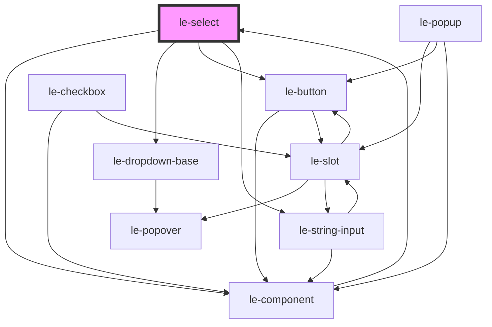

# le-select

<!-- Auto Generated Below -->

## Overview

A select dropdown component for single selection.

## Properties

| Property      | Attribute     | Description                                                 | Type                                 | Default              |
| ------------- | ------------- | ----------------------------------------------------------- | ------------------------------------ | -------------------- |
| `disabled`    | `disabled`    | Whether the select is disabled.                             | `boolean`                            | `false`              |
| `emptyText`   | `empty-text`  | Text to show when no options match the search.              | `string`                             | `'No results found'` |
| `fullWidth`   | `full-width`  | Whether the select should take full width of its container. | `boolean`                            | `false`              |
| `name`        | `name`        | Name attribute for form submission.                         | `string`                             | `undefined`          |
| `open`        | `open`        | Whether the dropdown is currently open.                     | `boolean`                            | `false`              |
| `options`     | `options`     | The options to display in the dropdown.                     | `LeOption[] \| string`               | `[]`                 |
| `placeholder` | `placeholder` | Placeholder text when no option is selected.                | `string`                             | `'Select an option'` |
| `required`    | `required`    | Whether selection is required.                              | `boolean`                            | `false`              |
| `searchable`  | `searchable`  | Whether the input is searchable.                            | `boolean`                            | `false`              |
| `size`        | `size`        | Size variant of the select.                                 | `"large" \| "medium" \| "small"`     | `'medium'`           |
| `value`       | `value`       | The currently selected value.                               | `number \| string`                   | `undefined`          |
| `variant`     | `variant`     | Visual variant of the select.                               | `"default" \| "outlined" \| "solid"` | `'default'`          |

## Events

| Event     | Description                              | Type                                |
| --------- | ---------------------------------------- | ----------------------------------- |
| `change`  | Emitted when the selected value changes. | `CustomEvent<LeOptionSelectDetail>` |
| `leClose` | Emitted when the dropdown closes.        | `CustomEvent<void>`                 |
| `leOpen`  | Emitted when the dropdown opens.         | `CustomEvent<void>`                 |

## Methods

### `hideDropdown() => Promise<void>`

Closes the dropdown.

#### Returns

Type: `Promise<void>`

### `showDropdown() => Promise<void>`

Opens the dropdown.

#### Returns

Type: `Promise<void>`

## Dependencies

### Used by

 - [le-component](../le-component)

### Depends on

- [le-component](../le-component)
- [le-dropdown-base](../le-dropdown-base)
- [le-button](../le-button)
- [le-string-input](../le-string-input)

### Graph

----------------------------------------------

*Built with [StencilJS](https://stenciljs.com/)*
