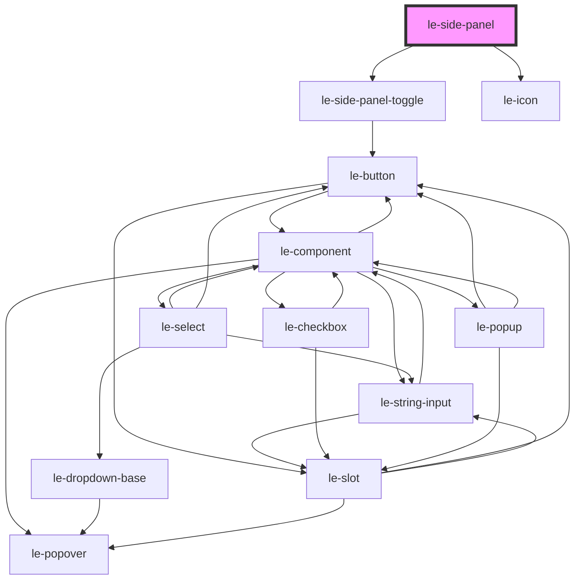

# le-side-panel

<!-- Auto Generated Below -->

## Properties

| Property           | Attribute             | Description                                                                                                                       | Type                  | Default        |
| ------------------ | --------------------- | --------------------------------------------------------------------------------------------------------------------------------- | --------------------- | -------------- |
| `autoHideOnNarrow` | `auto-hide-on-narrow` | When crossing to narrow mode, automatically hide the panel (open=false).                                                          | `boolean`             | `true`         |
| `autoShowOnWide`   | `auto-show-on-wide`   | When crossing to wide mode, automatically show the panel (collapsed=false).                                                       | `boolean`             | `true`         |
| `collapseAt`       | `collapse-at`         | Width breakpoint (in px or a CSS var like `--le-breakpoint-md`) below which the panel enters "narrow" mode.                       | `string`              | `undefined`    |
| `collapsed`        | `collapsed`           | Panel collapsed state for wide mode (fully hidden).                                                                               | `boolean`             | `false`        |
| `maxPanelWidth`    | `max-panel-width`     | Maximum allowed width when resizable.                                                                                             | `number`              | `420`          |
| `minPanelWidth`    | `min-panel-width`     | Minimum allowed width when resizable.                                                                                             | `number`              | `220`          |
| `narrowBehavior`   | `narrow-behavior`     | Behavior when in narrow mode.                                                                                                     | `"overlay" \| "push"` | `'overlay'`    |
| `open`             | `open`                | Panel open state for narrow mode. - overlay: controls modal drawer visibility - push: controls whether panel is shown (non-modal) | `boolean`             | `false`        |
| `panelId`          | `panel-id`            | Optional id used to match toggle requests. If set, the panel only responds to toggle events with the same `panelId`.              | `string`              | `undefined`    |
| `panelLabel`       | `panel-label`         | Accessible label for the panel navigation region.                                                                                 | `string`              | `'Navigation'` |
| `panelWidth`       | `panel-width`         | Default panel width in pixels.                                                                                                    | `number`              | `280`          |
| `persistKey`       | `persist-key`         | When set, panel width + collapsed state are persisted in localStorage.                                                            | `string`              | `undefined`    |
| `resizable`        | `resizable`           | Allows users to resize the panel by dragging its edge.                                                                            | `boolean`             | `false`        |
| `showCloseButton`  | `show-close-button`   | Show a close button inside the panel (primarily used in narrow overlay mode).                                                     | `boolean`             | `true`         |
| `side`             | `side`                | Which side the panel is attached to.                                                                                              | `"end" \| "start"`    | `'start'`      |

## Events

| Event                        | Description | Type                                                     |
| ---------------------------- | ----------- | -------------------------------------------------------- |
| `leSidePanelCollapsedChange` |             | `CustomEvent<{ collapsed: boolean; panelId?: string; }>` |
| `leSidePanelOpenChange`      |             | `CustomEvent<{ open: boolean; panelId?: string; }>`      |
| `leSidePanelWidthChange`     |             | `CustomEvent<{ width: number; panelId?: string; }>`      |

## Shadow Parts

| Part               | Description |
| ------------------ | ----------- |
| `"close-button"`   |             |
| `"content"`        |             |
| `"overlay"`        |             |
| `"panel"`          |             |
| `"panel-scroller"` |             |
| `"resize-handle"`  |             |
| `"scrim"`          |             |

## Dependencies

### Depends on

- [le-side-panel-toggle](../le-side-panel-toggle)
- [le-icon](../le-icon)

### Graph

----------------------------------------------

*Built with [StencilJS](https://stenciljs.com/)*
