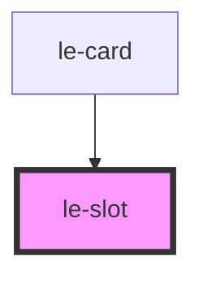

# le-slot

<!-- Auto Generated Below -->

## Overview

Slot placeholder component for admin/CMS mode.

This component renders a visual placeholder for slots when in admin mode,
allowing CMS systems to show available drop zones for content.

In non-admin mode, this component renders nothing and acts as a passthrough.

## Properties

| Property            | Attribute            | Description                                                                                               | Type      | Default     |
| ------------------- | -------------------- | --------------------------------------------------------------------------------------------------------- | --------- | ----------- |
| `allowedComponents` | `allowed-components` | Comma-separated list of allowed component tags for this slot. Used by CMS to filter available components. | `string`  | `undefined` |
| `description`       | `description`        | Description of what content this slot accepts. Shown in admin mode to guide content editors.              | `string`  | `undefined` |
| `label`             | `label`              | Label to display in admin mode. If not provided, the slot name will be used.                              | `string`  | `undefined` |
| `multiple`          | `multiple`           | Whether multiple components can be dropped in this slot.                                                  | `boolean` | `true`      |
| `name`              | `name`               | The name of the slot this placeholder represents. Should match the slot name in the parent component.     | `string`  | `''`        |
| `required`          | `required`           | Whether this slot is required to have content.                                                            | `boolean` | `false`     |

## Slots

| Slot | Description                                          |
| ---- | ---------------------------------------------------- |
|      | Default slot for placeholder content or drop zone UI |

## Dependencies

### Used by

 - [le-card](../le-card)

### Graph

----------------------------------------------

*Built with [StencilJS](https://stenciljs.com/)*
